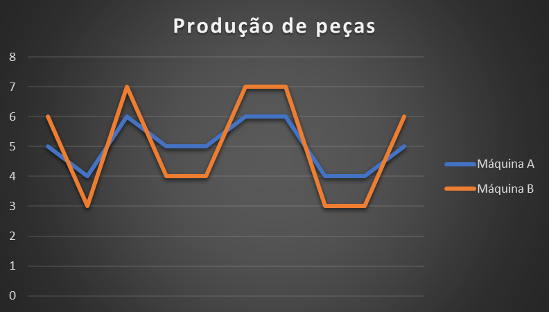
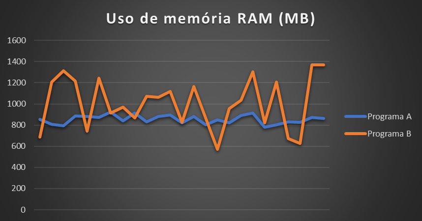
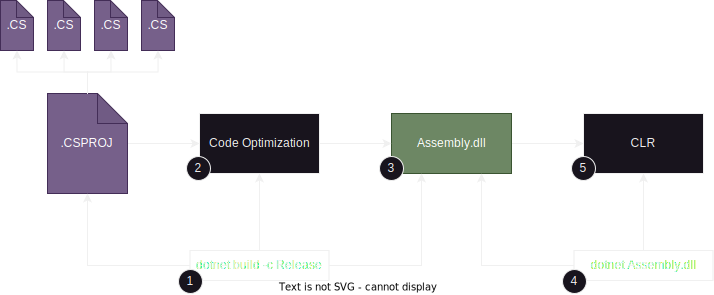

# Benchmarks

> [!IMPORTANT]
> Este documento não é um tutorial sobre benchmarks, mas sim, uma explicação dos fundamentos utilizados para os benchmarks realizados nesse projeto.

## :book: Conteúdo
- [Benchmarks](#benchmarks)
  - [:book: Conteúdo](#book-conteúdo)
  - [:pushpin: O que é um benchmark?](#pushpin-o-que-é-um-benchmark)
  - [:pushpin: O que comparar?](#pushpin-o-que-comparar)
  - [:pushpin: Mitos sobre benchmarks](#pushpin-mitos-sobre-benchmarks)
    - [:pushpin: Mito 1: A única coisa que temos que avaliar é o tempo de execução do código](#pushpin-mito-1-a-única-coisa-que-temos-que-avaliar-é-o-tempo-de-execução-do-código)
    - [:pushpin: Mito 2: O código que eu escrevi é o mesmo que é executado](#pushpin-mito-2-o-código-que-eu-escrevi-é-o-mesmo-que-é-executado)
    - [:pushpin: Mito 3: Uma vez o benchmark feito, basta executá-lo a qualquer momento](#pushpin-mito-3-uma-vez-o-benchmark-feito-basta-executá-lo-a-qualquer-momento)
  - [:pushpin: Como interpretar os valores do resultado do benchmark?](#pushpin-como-interpretar-os-valores-do-resultado-do-benchmark)
    - [:pushpin: Mean (Média)](#pushpin-mean-média)
    - [:pushpin: Análise de uso de CPU](#pushpin-análise-de-uso-de-cpu)
      - [:pushpin: Hardware counters disponíveis](#pushpin-hardware-counters-disponíveis)
        - [:pushpin: Exemplo simplificado](#pushpin-exemplo-simplificado)
      - [:pushpin: Relação entre os indicadores](#pushpin-relação-entre-os-indicadores)
    - [:pushpin: Análise de uso de memória RAM](#pushpin-análise-de-uso-de-memória-ram)
  - [:pushpin: Considerações finais](#pushpin-considerações-finais)

## :pushpin: O que é um benchmark?

[voltar ao topo](#book-conteúdo)

Um benchmark é uma comparação entre duas ou mais coisas. Quando não estamos comparando com algo, estamos simplesmente fazendo uma medição e não um benchmark. Mas quando estamos falando sobre software, associamos o termo benchmark tanto para medir a execução de algum sistema ou componente quanto para a comparação entre sistemas e/ou componentes.

<br/>

> [!TIP]
> Na prática, usamos o benchmark para medir e comparar o desempenho do sistema e/ou seus componentes.

> 
<br/>

## :pushpin: O que comparar?

[voltar ao topo](#book-conteúdo)

Nós podemos medir e comparar diversas coisas quando estamos falando sobre software. Podemos medir o tempo em que o sistema demora para executar determinada tarefa, podemos medir o quanto de recursos (CPU, RAM, HD, Network, etc.) são utilizados durante determinada ação que o software executa, podemos medir quanto tempo o sistema demora para inicializar e estar completamente pronto para realizar suas tarefas, e mais um monte de coisa.

No nosso caso, estamos falando de uma biblioteca que é executada por outros sistemas. Devido a isso, vamos realizar medições que façam sentido para esse cenário. Ou seja, vamos medir:

- Tempo de execução.
- Alocação de memória.
- Quantidade de ciclos de processamento.
- Erros que ocorreram.
- Estabilidade do código.


<br/>

> [!IMPORTANT]
> Devemos medir o que faz sentido para o cenário no qual nosso projeto foi idealizado.

<br/>

Após a medição, vamos realizar a comparação entre as medições de diferentes variações do código para tirarmos conclusões a partir dos dados obtidos. Mas antes, vamos analisar alguns pontos que acabam se tornando verdadeiros mitos quando falamos de benchmark.

## :pushpin: Mitos sobre benchmarks

[voltar ao topo](#book-conteúdo)

Existem mitos sobre benchmarks, e o objetivo é falar sobre alguns desses mitos para que possamos ter uma compreensão mais clara sobre benchmarks e ter um alinhamento claro sobre alguns pontos.

### :pushpin: Mito 1: A única coisa que temos que avaliar é o tempo de execução do código

[voltar ao topo](#book-conteúdo)

Podemos ter a impressão de que a única coisa que importa é a velocidade do código, ou seja, quanto mais rápido, melhor o código, mas isso não é uma verdade simples e absoluta.

Para entender melhor esse ponto, vamos fazer uma ilustração com duas máquinas industriais hipotéticas. Essas máquinas produzem um determinado produto. Foram produzidas uma amostra de dez produtos (claro que o ideal é produzir muito mais peças para comparar, mas para facilitar o exemplo, usaremos dez peças somente) e, para cada peça construída, anotamos o tempo que levou para cada peça. Vamos analisar os dados:

<div align="center">

<table>

<td>

| Máquina A ||
|:----:|:----:|
| Número peça | Duração (minutos) |
|1|5|
|2|4|
|3|6|
|4|5|
|5|5|
|6|6|
|7|6|
|8|4|
|9|4|
|10|5|
| Total | 50 minutos |
| Média | 5 minutos |
| Desvio Padrão | 0,77 |

</td>

<td>

| Máquina B ||
|:----:|:----:|
| Número peça | Duração (minutos) |
|1|6|
|2|3|
|3|7|
|4|4|
|5|4|
|6|7|
|7|7|
|8|3|
|9|3|
|10|6|
| Total | 50 minutos |
| Média | 5 minutos |
| Desvio Padrão | 1,67 |

</td>

</table>

</div>

Note que tanto a `máquina A` quanto a `máquina B` levaram um total de `50 minutos`. Já que ambas as máquinas demoraram o mesmo tempo total, quer dizer que ambas tiveram o mesmo desempenho? `NÃO!` Vamos analisar melhor.

<br/>

> [!IMPORTANT]
> Códigos com eficiências diferentes podem ter o mesmo tempo de execução.

<br/> 

Vamos expressar essas duas tabelas em dois gráficos:

<br/>
<div align="center">



</div>
<br/>

Incluir uma série (em laranja) que representa a média móvel. Mas por quê isso? Quanto mais próximo o valor (série em azul) estiver da média móvel (série em laranja), menos variação teve, ou seja, mais estável e previsível o valor é.

Note que a `máquina A` ficou com os valores `mais próximos` da média móvel, já a `máquina B` ficou com valores `mais distantes` da média móvel. Isso quer dizer que a máquina B é mais instável. Então o que podemos concluir da análise dessas duas máquinas?

**Conclusões:**
- As máquinas A e B utilizaram o mesmo tempo total para produzir as 10 peças.
- A máquina A foi mais estável e previsível na duração por peça do que a máquina B.
- O pico de tempo mais alto da máquina A foi de 6 minutos, enquanto na máquina B foi de 7 minutos.

Para uma linha de produção de peças, buscamos `previsibilidade`. Portanto, embora as duas máquinas tenham demorado o mesmo tempo total para produzir as 10 peças, a `máquina A` trouxe uma previsibilidade de tempo muito maior, pois a duração da produção das peças ficou mais próxima da média móvel.

Medimos essa distância do valor da média móvel a partir de uma medida estatística chamada `desvio padrão`. Os desvios padrões das máquinas A e B foram:

<div align="center">

| Máquina | Desvio Padrão |
| :-: | :-: |
| Máquina A | 0,77 |
| Máquina B | 1,67 |

</div>

<br/>

> [!IMPORTANT]
> O desvio padrão é o controle de qualidade da média: quanto mais baixo, menos a média varia, ou seja, é mais estável!

<br/> 

Como isso se aplica com benchmarks em programação? Note o resultado de um benchmark que fizemos no documento [decisões de design](DESIGN-DECISIONS-PT.md) quando estávamos analisando sobre Exceptions:

| Type             | Method                                        | Mean (ns) | Error (ns) | StdDev (ns) | CacheMisses/Op | TotalIssues/Op | TotalCycles/Op | BranchInstructions/Op | BranchMispredictions/Op | Gen0 | Allocated (B) |
|------------------|-----------------------------------------------|-----------|------------|-------------|----------------|----------------|----------------|-----------------------|-------------------------|------|---------------|
| With null        | CreateOutputEnvelopWithoutMessageAndException | 8,603     | 0,0223     | 0,0186      | 0              | 47             | 16             | 11                    | 0                       | 0    | 0             |
| With empty array | CreateOutputEnvelopWithoutMessageAndException | 117,26    | 1,964      | 2,879       | 0              | 518            | 257            | 123                   | 0                       | 0    | 0             |

Note que a coluna `StdDev (ns)` tem o menor valor do `desvio padrão` para o teste `With null` em relação ao teste `With empty array`. Isso quer dizer que o teste `With null` foi muito mais estável com relação ao tempo de execução. Na coluna `Mean (ns)` conseguimos comprovar que o teste `With null` foi mais rápido, mas caso utilizassem o mesmo tempo ou tivessem um tempo mais próximo, deveríamos utilizar o valor do desvio padrão na análise também!

Se estivéssemos falando de memória RAM, por exemplo, poderíamos ter um código que demorasse o mesmo tempo, mas, por causa do desvio padrão alto, poderiam ocorrer picos de uso de memória RAM, exigindo um servidor com uma quantidade maior de memória RAM, por exemplo: o código executa com 500 MB de memória RAM, mas como o uso de memória está com um alto desvio padrão, em algum momento esse código atinge um pico de 900 MB de memória. Isso quer dizer que teríamos que ter reservado (em uma máquina, um cluster K8S etc.) um total de 1 GB de memória somente para atender a um possível pico de consumo de memória. Um código mais estável poderia demorar o mesmo tempo final, mas, por ter um desvio padrão menor, não ultrapassaria 750 MB de RAM, por exemplo.

Vamos finalizar esse assunto vendo um gráfico hipotético de uso de memória RAM de dois programas que demoram o mesmo tempo para executar o processo:

<br/>
<div align="center">



</div>
<br/>

Embora tanto o `Programa A` quanto o `Programa B` demorem o `mesmo tempo para executar`, conseguimos ver como o `Programa B varia muito mais no uso de memória RAM`. Isso quer dizer que enquanto o `Programa A` executaria com até `1 GB de memória RAM`, o `Programa B` precisaria de `1,5 GB de memória RAM` devido à sua instabilidade no uso de memória RAM, ou seja, o `Programa A é mais eficiente no uso de memória` embora ambos utilizem o mesmo tempo de execução.


<br/>

> [!IMPORTANT]
> Códigos mais estáveis permitem reservar menos recursos de hardware para a aplicação

<br/> 

### :pushpin: Mito 2: O código que eu escrevi é o mesmo que é executado

[voltar ao topo](#book-conteúdo)

Nós podemos acreditar que o código gerado é o mesmo que executamos, mas isso não é verdade. Independentemente de sua aplicação ser compilada ou interpretada, o código executado não coincide exatamente com o que você escreveu. Se você deseja entender mais sobre esse assunto, recomendo assistir ao vídeo do Fabio Akita, disponível neste [link](https://www.youtube.com/watch?v=SNyh-cubxaU).

O ponto crucial é que, ao escrevermos o código para benchmark, é imperativo levar isso em consideração. Vou explicar brevemente e de forma resumida (apenas o necessário para o exemplo) o que ocorre no .NET quando compilamos nosso código no modo Release. Observe o diagrama a seguir:


<br/>
<div align="center">



</div>
<br/>

Vamos compreender o que está acontecendo:

- Temos nosso projeto C# (arquivo .csproj) com seus respectivos arquivos de código (arquivos .cs).
- **Passo 1:** Executamos o comando `dotnet build -c Release` para compilar o projeto no modo `Release`.
- **Passo 2:** Durante a compilação no modo Release, ocorre um processo de `otimização` em nosso código realizado pelo `Roslyn`, o compilador do C#.
- **Passo 3:** O resultado desse processo é o nosso assembly.
- **Passo 4:** Utilizamos o comando `dotnet` para executar o código contido no arquivo gerado no passo 3.
- **Passo 5:** A `CLR (Common Language Runtime)` executa nosso assembly.

No .NET 8, houve a inclusão do suporte ao [AOT](https://learn.microsoft.com/en-us/dotnet/core/deploying/native-aot/?tabs=net8plus%2Cwindows), mas isso não impactará no ponto abordado em nosso exemplo.

<br/>

> [!IMPORTANT]
> A compilação no modo Release realiza otimizações em nosso código durante o processo de compilação.


<br/> 

Essa otimização realizada tem um impacto direto em nosso benchmark. Vamos analisar alguns exemplos de códigos que escrevemos e como eles se comportarão após a compilação no modo Release:

- Exemplo 1

<div align="center">

<table>

<td>

```csharp
// Código original
public class SampleClass {
    public int SampleMethod() {
        
        var number1 = 10;
        var number2 = 12;
        var sum = number1 + number2;
        
        return sum;
    }
}
```

</td>

<td>

```csharp
// Código compilado em modo release
public class SampleClass
{
    public int SampleMethod()
    {
        int num = 10;
        int num2 = 12;
        return num + num2;
    }
}

```

</td>

</table>

</div>

- Exemplo 2

<div align="center">

<table>

<td>

```csharp
// Código original
public class SampleClass {
    public String SampleMethod(string[] names) {
        
        var sb = new StringBuilder();
        
        foreach(var name in names)
        {
            sb.Append(name);
        }
        
        return sb.ToString();
    }
}


```

</td>

<td>

```csharp
// Código compilado em modo release
public class SampleClass
{
    [NullableContext(1)]
    public string SampleMethod(string[] names)
    {
        StringBuilder stringBuilder = new StringBuilder();
        int num = 0;
        while (num < names.Length)
        {
            string value = names[num];
            stringBuilder.Append(value);
            num++;
        }
        return stringBuilder.ToString();
    }
}
```

</td>

</table>

</div>

- Exemplo 3

<div align="center">

<table>

<td>

```csharp
// Código original
public class SampleClass {
    public String SampleMethod1(
        String logradouro, 
        String numero
    )
    {
        return $"{logradouro}, n {numero}";
    }
    public String SampleMethod2(
        String logradouro, 
        String numero, 
        String bairro, 
        String cidade, 
        String estado
    ) 
    {
        return $"{logradouro}, n {numero} - {bairro} - {cidade}/{estado}";
    }
}


```

</td>

<td>

```csharp
// Código compilado em modo release
[NullableContext(1)]
[Nullable(0)]
public class SampleClass
{
    public string SampleMethod1(
      string logradouro, 
      string numero
    )
    {
        return string.Concat(logradouro, ", n ", numero);
    }

    public string SampleMethod2(
      string logradouro, 
      string numero, 
      string bairro, 
      string cidade, 
      string estado
    )
    {
        DefaultInterpolatedStringHandler defaultInterpolatedStringHandler = 
          new DefaultInterpolatedStringHandler(11, 5);
        defaultInterpolatedStringHandler.AppendFormatted(logradouro);
        defaultInterpolatedStringHandler.AppendLiteral(", n ");
        defaultInterpolatedStringHandler.AppendFormatted(numero);
        defaultInterpolatedStringHandler.AppendLiteral(" - ");
        defaultInterpolatedStringHandler.AppendFormatted(bairro);
        defaultInterpolatedStringHandler.AppendLiteral(" - ");
        defaultInterpolatedStringHandler.AppendFormatted(cidade);
        defaultInterpolatedStringHandler.AppendLiteral("/");
        defaultInterpolatedStringHandler.AppendFormatted(estado);
        return defaultInterpolatedStringHandler.ToStringAndClear();
    }
}
```

</td>

</table>

</div>

Observe como o código sofreu alterações significativas, principalmente nos loops. Portanto, ao realizar um benchmark, é crucial considerar essas mudanças e escrever um código de benchmark que represente de perto o cenário real. Como demonstrado no exemplo 3, até mesmo os objetos que serão utilizadas no código podem sofrer alterações.


<br/>

> [!IMPORTANT]
> O benchmark deve ser semelhante ao cenário real para evitar medições com situações que não ocorreram em produção.

<br/> 

### :pushpin: Mito 3: Uma vez o benchmark feito, basta executá-lo a qualquer momento

[voltar ao topo](#book-conteúdo)

Imagine um veículo que você deseja testar o consumo de combustível na cidade. Se você medir esse consumo em um dia frio e em um dia quente, os resultados serão diferentes. Da mesma forma, testar com o motor frio ou quente, ou com pneus calibrados de maneiras diferentes, resultará em variações nos resultados. Em outras palavras, as condições do ambiente de teste influenciam diretamente nos resultados obtidos.


<br/>

> [!IMPORTANT]
> As condições do ambiente do nosso teste influenciam no resultado.

<br/>

No nosso cenário onde estamos validando uma biblioteca onde queremos analisar o comportamento de uso de CPU e memória RAM, nós temos que tomar alguns cuidados durante a execução:

- É importante que tentemos garantir as mesmas condições do PC em todas as execuções do benchmark (processos em execução, equipamentos conectados etc.).
- Tanto a memória RAM quanto a CPU mantém informações em cache, então temos que executar o benchmark mais de uma vez e comprar os resultados.
- Devemos estabelecer condições próximas ao do ambiente que queremos validar.

Note o cenário a seguir de execução do benchmark [ThrowExceptionBenchmark](../benchs/Benchmarks/ExceptionBenchs/ThrowExceptionBenchmark.cs):

- Windows 11 - .NET 8
```pwsh
BenchmarkDotNet v0.13.11, Windows 11 (10.0.22631.2861/23H2/2023Update/SunValley3)
AMD Ryzen 5 5600X, 1 CPU, 12 logical and 6 physical cores
.NET SDK 8.0.100
  [Host]     : .NET 8.0.0 (8.0.23.53103), X64 RyuJIT AVX2
  Job-NYRBNL : .NET 8.0.0 (8.0.23.53103), X64 RyuJIT AVX2

Server=True  RunStrategy=Throughput

| Method        | Mean          | Error      | StdDev     | Ratio     | RatioSD | Allocated | Alloc Ratio |
|-------------- |--------------:|-----------:|-----------:|----------:|--------:|----------:|------------:|
| NoException   |     0.1405 ns |  0.0043 ns |  0.0040 ns |      1.00 |    0.00 |         - |          NA |
| WithException | 3,551.3669 ns | 12.0084 ns | 10.0276 ns | 25,309.80 |  778.20 |     232 B |          NA |
```

- Ubuntu 22.04 WSL - .NET 8
```pwsh
BenchmarkDotNet v0.13.11, Ubuntu 22.04.3 LTS (Jammy Jellyfish) WSL
AMD Ryzen 5 5600X, 1 CPU, 8 logical and 4 physical cores
.NET SDK 8.0.100
  [Host]     : .NET 8.0.0 (8.0.23.53103), X64 RyuJIT AVX2
  Job-ZMPFWB : .NET 8.0.0 (8.0.23.53103), X64 RyuJIT AVX2

Server=True  RunStrategy=Throughput

| Method        | Mean          | Error       | StdDev     | Ratio     | RatioSD  | Allocated | Alloc Ratio |
|-------------- |--------------:|------------:|-----------:|----------:|---------:|----------:|------------:|
| NoException   |     0.1352 ns |   0.0088 ns |  0.0074 ns |      1.00 |     0.00 |         - |          NA |
| WithException | 6,207.4252 ns | 106.1501 ns | 94.0993 ns | 45,931.00 | 2,275.69 |     232 B |          NA |
```

O mesmo benchmark foi executado utilizando o `.NET 8.0.0 (8.0.23.53103)` nos ambientes `Windows 11 (10.0.22631.2861/23H2/2023Update/SunValley3)` e `Ubuntu 22.04.3 LTS (Jammy Jellyfish) WSL`. Note que o mesmo benchmark apresentou resultados diferentes em sistemas diferentes e com configurações diferentes. Por isso que o objetivo de quando formos executar um benchmark em um ambiente diferente do ambiente que o programa realmente será utilizado, ele servirá somente como um guia, um norte para comparar cenários e não como um valor absoluto.

<br/>

> [!IMPORTANT]
> Quando o benchmark está sendo feito fora do ambiente final em que o programa estará, devemos utilizar o resultado de um benchmark para comprar um cenário com relação a outro e não como uma referência absoluta

<br/>

## :pushpin: Como interpretar os valores do resultado do benchmark?

[voltar ao topo](#book-conteúdo)

Essa é uma biblioteca para ser utilizada em .NET que foi feita usando o [.NET Standard 2.0](https://learn.microsoft.com/pt-br/dotnet/standard/net-standard?tabs=net-standard-2-0). Isso quer dizer que vamos analisar o ocmportamento de RAM e CPU desse código pois ele não realiza conexão de rede e não realiza gravação ou leitura no disco. Foi utilizado a biblioteca [BenchmarkDotNet](https://benchmarkdotnet.org/articles/overview.html). O objetivo desse documento não é dar um treinamento dessa biblioteca, mas sim, explicar como os resultados serão interpretados para o nosso objetivo. Deixo como sugestão ler a documentação da biblioteca [BenchmarkDotNet](https://benchmarkdotnet.org/articles/overview.html) caso queira saber como utilizá-la.

Vamos analisar o retorno de uma execução e entender o que isso significa:

<br/>

| Method        | Mean           | Error       | StdDev      | Ratio     | RatioSD  | TotalCycles/Op | TotalIssues/Op | BranchInstructions/Op | Timer/Op | BranchMispredictions/Op | CacheMisses/Op | Allocated | Alloc Ratio |
|-------------- |---------------:|------------:|------------:|----------:|---------:|---------------:|---------------:|----------------------:|---------:|------------------------:|---------------:|----------:|------------:|
| NoException   |      0.4783 ns |   0.0276 ns |   0.0245 ns |      1.00 |     0.00 |              1 |              3 |                     0 |        0 |                       0 |             -0 |         - |          NA |
| WithException | 23,434.1564 ns | 292.3356 ns | 273.4509 ns | 49,158.82 | 2,651.56 |         54,006 |         78,379 |                17,448 |      235 |                     137 |            382 |     232 B |          NA |

<br/>

- **Method:** O nome do método que está sendo testado.
- **Mean (Média):** A média aritmética dos tempos de execução medidos para o método. É a principal medida de desempenho e representa o tempo médio que leva para executar uma iteração do método.
- **Error (Erro):** O intervalo de confiança em torno da média, expresso como um desvio padrão. Indica a variabilidade nos resultados. 
- **StdDev (Desvio Padrão):** O desvio padrão dos tempos de execução. Ele fornece uma medida da dispersão dos resultados em relação à média.
- **Ratio (Proporção):** A relação entre o tempo médio do método em teste e o tempo médio do método de referência (geralmente o método mais rápido).
- **RatioSD (Desvio Padrão da Proporção):** O desvio padrão da relação entre os tempos médios. Indica a variabilidade na proporção.
- **TotalCycles/Op (Ciclos Totais por Operação):** O número total de ciclos de CPU por operação. Fornece informações sobre o uso da CPU.
- **TotalIssues/Op (Total de Problemas por Operação):** O número total de problemas de execução por operação. Pode indicar problemas de execução de instruções.
- **BranchInstructions/Op (Instruções de Ramificação por Operação):** O número total de instruções de ramificação por operação. Fornece informações sobre o comportamento do fluxo de controle no código.
- **Timer/Op (Temporizador por Operação):** O tempo médio, em nanossegundos, que leva para executar uma operação. Pode ser usado para avaliar o desempenho absoluto em termos de tempo.
- **BranchMispredictions/Op (Predições Incorretas de Ramificação por Operação):** O número de predições de ramificação incorretas por operação. Indica o desempenho do processador em relação às instruções de ramificação.
- **CacheMisses/Op (Faltas de Cache por Operação):** O número de falhas de cache por operação. Indica o comportamento de acesso à memória e a eficiência do cache.
- **Allocated (Alocado):** A quantidade total de memória alocada durante a execução do método.
- **Alloc Ratio (Razão de Alocação):** A relação entre a quantidade de memória alocada pelo método em teste e a quantidade de memória alocada pelo método de referência.

<br/>

Agora, considerando uma definição mais formal, se você for um iniciante ou não tiver familiaridade com arquitetura de computadores ou alguns conceitos matemáticos, pode ser que não tenha compreendido completamente. Vamos, então, analisar de forma simplificada.

### :pushpin: Mean (Média)

[voltar ao topo](#book-conteúdo)

A média é uma medida estatística básica, mas pode nos surpreender em alguns casos. A média é definida como a `soma dos elementos dividido pela quantidade de elementos`. Por exemplo:

Dado os números 10, 9, 8 e 7, a média seria calculada como a `soma dos elementos (10 + 9 + 8 + 7)` `dividido pela quantidade de elementos (4 elementos)`. A fórmula matemática seria $(10 + 9 + 8 + 7)/4$ e o resultado é `8,5`.

Até aqui, parece que está tudo bem; no entanto, a média pode nos enganar se não tratarmos algo chamado de `outliers`. Outliers são valores que se diferenciam drasticamente dos demais dados. Vamos entender melhor com um exemplo:

Vamos considerar duas turmas hipotéticas de 5 alunos cada, a `Turma A` e a `Turma B`. Foi aplicada uma prova idêntica para os alunos de ambas as turmas, e os resultados foram os seguintes:


<div align="center">

<table>

<td>

| Turma A | |
|:-:|:-:|
| Aluno | Nota |
| 1 | 10 |
| 2 | 9,5 |
| 3 | 10 |
| 4 | 9 |
| 5 | 2 |
| Média: | 7,9 |

</td>

<td>

| Turma B | |
|:-:|:-:|
| Aluno | Nota |
| 1 | 8 |
| 2 | 8,5 |
| 3 | 9 |
| 4 | 8 |
| 5 | 8,5 |
| Média: | 8,4 |

</td>

</table>

</div>

Com base nesses dados, ao `analisar a média`, podemos concluir que a `Turma B` possui `alunos com notas melhores`, afinal, a `média de notas da Turma B foi maior`. Mas isso reflete a realidade? Não!

O que aconteceu para a média não refletir a realidade? Na turma A, tivemos uma nota que divergiu completamente das demais: o aluno 5 tirou a nota 2! Isso impactou significativamente na média, dando a impressão de que os alunos da turma A tiveram uma nota abaixo do que realmente foi.

Como resolver isso? Temos duas opções: `(1) Utilizar a mediana no lugar da média` ou `(2) remover os outliers da análise`.

O caminho que vamos adotar é o de remover os outliers, pois a biblioteca BenchmarkDotnet segue essa abordagem na coluna `mean`.

Ao remover a nota 2 do aluno 5 da turma A, a média da turma seria `9,38`, refletindo muito mais a realidade!


<br/>

> [!IMPORTANT]
> Não devemos analisar os valores isoladamente. É essencial contextualizá-los com o negócio para verificar se fazem sentido.

<br/>


### :pushpin: Análise de uso de CPU

[voltar ao topo](#book-conteúdo)

Hardware counters, ou contadores de hardware, são elementos embutidos nos processadores de um computador que monitoram e contam eventos específicos relacionados ao desempenho do sistema. Esses eventos podem incluir coisas como instruções executadas, acessos à memória, ciclos de clock, entre outros. Os hardware counters fornecem métricas valiosas para avaliar o desempenho de um programa ou sistema em nível de baixo nível, permitindo aos desenvolvedores otimizar o código para melhor eficiência.

**Principais Pontos:**
- São elementos internos dos processadores.
- Monitoram eventos específicos relacionados ao desempenho.
- Contam coisas como instruções executadas, acessos à memória, ciclos de clock, etc.
- Fornecem métricas para avaliação de desempenho.
- Permitem otimização de código para maior eficiência.

#### :pushpin: Hardware counters disponíveis

[voltar ao topo](#book-conteúdo)

Na biblioteca [BenchmarkDotnet](https://www.nuget.org/packages/BenchmarkDotNet) (até a versão 0.13.11), os hardware counters disponíveis são:

1. **Timer:**
   - **O que é:** Mede o tempo total que o teste levou para ser executado.
   - **Exemplo prático:** Medição do tempo de execução de um algoritmo de ordenação de uma lista de números.
   - **Consequência Negativa:** Tempos de execução longos podem resultar em tempos de resposta lentos para os usuários, prejudicando a experiência do usuário.
   - **Sugestões de Melhoria:** Refatorar o código para otimizar algoritmos, reduzir operações desnecessárias e minimizar chamadas a recursos externos.

2. **TotalIssues:**
   - **O que é:** Conta quantas "coisas" o processador faz durante o teste.
   - **Exemplo prático:** Processamento de uma grande quantidade de dados.
   - **Consequência Negativa:** Um número excessivo de operações pode indicar ineficiências no código, resultando em maior consumo de recursos e possível lentidão.
   - **Sugestões de Melhoria:** Identificar e eliminar redundâncias no código, usar estruturas de dados mais eficientes e empregar algoritmos mais otimizados.

3. **BranchInstructions:**
   - **O que é:** Conta quantas vezes o computador toma decisões sobre qual caminho seguir no código.
   - **Exemplo prático:** Verificação de paridade de um número.
   - **Consequência Negativa:** Muitas instruções de branch podem levar a previsões incorretas, resultando em penalidades de desempenho.
   - **Sugestões de Melhoria:** Simplificar lógica condicional, evitar instruções de branch desnecessárias e usar estruturas de controle mais eficientes.

4. **CacheMisses:**
   - **O que é:** Conta quantas vezes o computador precisa buscar informações fora de sua "memória rápida".
   - **Exemplo prático:** Acesso a dados em uma matriz grande.
   - **Consequência Negativa:** Alto número de CacheMisses indica a necessidade frequente de buscar dados em memória mais lenta, resultando em atrasos.
   - **Sugestões de Melhoria:** Melhorar a localidade de dados, reorganizar estruturas de dados para melhor aproveitamento da cache e considerar o uso de prefetching.

5. **BranchMispredictions:**
   - **O que é:** Conta quantas vezes o computador prevê erroneamente qual caminho o código seguirá.
   - **Exemplo prático:** Loop que deve ser repetido várias vezes.
   - **Consequência Negativa:** Previsões incorretas podem resultar em ciclos desperdiçados e redução de desempenho.
   - **Sugestões de Melhoria:** Simplificar lógica de controle de fluxo, reduzir aninhamentos excessivos e usar estratégias que favoreçam previsões mais eficientes.

6. **TotalCycles:**
   - **O que é:** Conta quantas vezes o relógio do processador completa uma volta completa.
   - **Exemplo prático:** Desempenho de um algoritmo de criptografia.
   - **Consequência Negativa:** Número elevado de ciclos pode indicar código não otimizado e tempo de execução mais longo.
   - **Sugestões de Melhoria:** Otimizar algoritmos, minimizar operações de E/S, reduzir instruções redundantes e empregar paralelismo quando possível.

7. **UnhaltedCoreCycles:**
   - **O que é:** Conta quantas vezes o processador está realmente "pensando" durante o teste.
   - **Exemplo prático:** Cálculos complexos em um programa.
   - **Consequência Negativa:** Subutilização do processador pode resultar em ineficiência do código.
   - **Sugestões de Melhoria:** Identificar e remover gargalos, otimizar loops e operações críticas, e explorar o potencial de paralelismo.

8. **InstructionRetired:**
   - **O que é:** Conta quantas instruções foram executadas pelo processador.
   - **Exemplo prático:** Operações matemáticas em um código.
   - **Consequência Negativa:** Muitas instruções podem indicar redundâncias ou ineficiências no código, resultando em execução mais lenta.
   - **Sugestões de Melhoria:** Utilizar algoritmos mais eficientes, minimizar operações redundantes e remover código não utilizado.

9. **UnhaltedReferenceCycles:**
   - **O que é:** Conta quantas vezes o processador faz referência a algo sem parar.
   - **Exemplo prático:** Streaming de dados em um programa.
   - **Consequência Negativa:** Muitas referências não paradas podem indicar uso ineficiente de recursos e maior consumo de energia.
   - **Sugestões de Melhoria:** Otimizar operações de leitura e escrita, reduzir acesso à memória principal e considerar estratégias de pré-busca de dados.

10. **LlcReference:**
    - **O que é:** Conta quantas vezes o código acessa um nível específico de memória (cache).
    - **Exemplo prático:** Leituras frequentes de dados em um programa.
    - **Consequência Negativa:** Eficiência do cache pode ser comprometida, resultando em desempenho insatisfatório.
    - **Sugestões de Melhoria:** Utilizar técnicas de cache-conscious programming, ajustar o tamanho e a organização de estruturas de dados e minimizar leituras sequenciais.

11. **LlcMisses:**
    - **O que é:** Conta quantas vezes o código tenta acessar informações que não estão na memória cache.
    - **Exemplo prático:** Acesso frequente a dados fora da memória cache.
    - **Consequência Negativa:** Acesso mais lento à memória devido a uma hierarquia de cache não otimizada.
    - **Sugestões de Melhoria:** Reorganizar dados para melhorar a localidade espacial e temporal, otimizar algoritmos para reduzir acessos à memória principal e considerar a implementação de estratégias de pré-carregamento.
12. **BranchInstructionRetired:**
    - **O que é:** Conta quantas instruções de decisão (branch) foram executadas.
    - **Exemplo prático:** Instruções de controle de fluxo (if, else) em um código.
    - **Consequência Negativa:** Muitas instruções de decisão podem indicar complexidade excessiva no código, resultando em desempenho inferior.
    - **Sugestões de Melhoria:** Simplificar lógica de controle de fluxo, utilizar estruturas de dados que minimizem a necessidade de instruções de branch e considerar otimizações específicas do compilador.

13. **BranchMispredictsRetired:**
    - **O que é:** Conta quantas previsões de decisões erradas foram feitas e corrigidas.
    - **Exemplo prático:** Previsões incorretas em um loop.
    - **Consequência Negativa:** Muitas previsões incorretas podem resultar em penalidades significativas de desempenho devido a fluxos de execução ineficientes.
    - **Sugestões de Melhoria:** Revisar e simplificar lógica condicional, reduzir aninhamentos excessivos e favorecer estruturas de controle que minimizem previsões incorretas.

Vamos reanalisar esses indicadores com um exemplo mais lúdico para ajudar nosso entendendimento:

##### :pushpin: Exemplo simplificado

[voltar ao topo](#book-conteúdo)

Imagine que seu computador é como um carro. O **tempo de execução** (Timer) é quanto tempo leva para o carro ir do ponto A ao ponto B. É importante saber quanto tempo leva para completar uma tarefa, mas também queremos saber o que está acontecendo dentro do carro para que possamos melhorar o desempenho.

Os contadores de hardware são como sensores que nos dizem o que está acontecendo dentro do processador, o "motor" do computador.


1. **TotalIssues:**

   - Conta quantas vezes o motor "pisa no acelerador" para enviar instruções para as rodas.
   - Mais "pisadas" significam que o motor está trabalhando duro.

2. **BranchInstructions:**

   - Conta quantas vezes o motorista precisa decidir qual caminho seguir.
   - Muitas decisões podem significar que o trajeto é confuso e pode ser otimizado.

3. **CacheMisses:**

   - Conta quantas vezes o motorista precisa parar para procurar o mapa em outro lugar porque não está no porta-luvas.
   - Muitas paradas podem significar que o motorista não está organizado e precisa planejar melhor.

4. **BranchMispredictions:**

   - Conta quantas vezes o motorista decide ir por um caminho errado e precisa voltar.
   - Erros podem atrasar a viagem e significam que o motorista precisa se concentrar mais.

5. **TotalCycles:**

   - Conta quantas vezes o motor gira as rodas.
   - Mais giros significam que o carro está se movendo, mas não necessariamente rápido.

6. **UnhaltedCoreCycles:**

   - Conta quantas vezes o motor está ligado e funcionando.
   - É importante saber quanto tempo o motor está realmente trabalhando, sem contar o tempo que ele está parado no farol.

7. **InstructionRetired:**

   - Conta quantas vezes o motorista pisa no freio e a engrenagem finalmente muda.
   - É importante saber quantas instruções o motor realmente conseguiu completar.

8. **UnhaltedReferenceCycles:**

   - Conta quantas vezes o motor precisa procurar informações no banco de dados do carro.
   - Muitas buscas podem significar que o banco de dados está mal organizado e precisa ser otimizado.

9. **LlcReference:**

   - Conta quantas vezes o motorista precisa procurar informações no porta-malas do carro.
   - Muitas buscas podem significar que o porta-malas está bagunçado e precisa ser organizado.

10. **LlcMisses:**

    - Conta quantas vezes o motorista procura algo no porta-malas e não encontra.
    - Muitas falhas podem significar que o motorista precisa planejar melhor o que levar na viagem.

11. **BranchInstructionRetired:**

    - Conta quantas vezes o motorista decide qual caminho seguir e finalmente faz a curva.
    - É importante saber quantas decisões o motorista realmente conseguiu tomar e executar.

12. **BranchMispredictsRetired:**

    - Conta quantas vezes o motorista decide ir por um caminho errado, volta e finalmente faz a curva correta.
    - Erros podem atrasar a viagem, mas é importante aprender com eles para melhorar no futuro.


É importante notar que esses indicadores se relacionam. Um caminho que podemos seguir ao relacionar esses indicadores é:

#### :pushpin: Relação entre os indicadores

[voltar ao topo](#book-conteúdo)

1. **Timer, TotalCycles, UnhaltedCoreCycles:**
   - **Relação:** O Timer está relacionado diretamente com o TotalCycles, que por sua vez está relacionado com os UnhaltedCoreCycles. Se o tempo de execução (Timer) é alto, isso pode indicar uma alta contagem de ciclos totais e de ciclos de núcleo não interrompidos.
   - **Implicações Negativas:** Altos tempos de execução podem indicar ineficiências no código, resultando em uma utilização excessiva de ciclos e núcleos do processador.
   - **Resolução:** Otimizar algoritmos, minimizar operações desnecessárias e explorar paralelismo são estratégias para reduzir ciclos e melhorar o tempo de execução.

2. **CacheMisses, LlcMisses, LlcReference:**
   - **Relação:** CacheMisses está relacionado com LlcMisses, que por sua vez está relacionado com LlcReference. Um alto número de referências à memória cache (LlcReference) e poucos acertos (LlcMisses) indicam uma boa utilização da cache.
   - **Implicações Negativas:** Muitos CacheMisses e LlcMisses indicam que o código está acessando frequentemente a memória principal, resultando em atrasos significativos.
   - **Resolução:** Melhorar a localidade de dados, reorganizar estruturas de dados e otimizar algoritmos para tirar melhor proveito da hierarquia de cache são estratégias para reduzir missões de cache.

3. **BranchInstructions, BranchMispredictions, BranchInstructionRetired, BranchMispredictsRetired:**
   - **Relação:** BranchInstructions está relacionado com BranchMispredictions, BranchInstructionRetired e BranchMispredictsRetired. Altas contagens de instruções de branch e previsões incorretas indicam decisões de controle de fluxo ineficientes.
   - **Implicações Negativas:** Muitos BranchMispredictions resultam em penalidades significativas de desempenho devido a fluxos de execução ineficientes.
   - **Resolução:** Simplificar lógica condicional, reduzir aninhamentos excessivos, usar estruturas de controle eficientes e considerar estratégias de previsão de branch mais eficazes são abordagens para melhorar o desempenho.

4. **InstructionRetired, UnhaltedReferenceCycles:**
   - **Relação:** A contagem de InstructionRetired está relacionada com UnhaltedReferenceCycles, indicando a execução de instruções e referências à memória.
   - **Implicações Negativas:** Muitas instruções e referências não interrompidas podem indicar uma utilização ineficiente dos recursos do processador.
   - **Resolução:** Otimizar operações de leitura e escrita, reduzir acessos à memória principal e explorar estratégias de pré-busca de dados são maneiras de melhorar a eficiência.

5. **TotalIssues:**
   - **Relação:** TotalIssues conta a quantidade total de trabalho realizado pela CPU, incluindo operações e decisões de controle de fluxo.
   - **Implicações Negativas:** Um alto número de TotalIssues pode indicar uma sobrecarga de trabalho, resultando em maior consumo de recursos e possíveis lentidões.
   - **Resolução:** Identificar e eliminar redundâncias no código, usar estruturas de dados eficientes e otimizar algoritmos são estratégias para reduzir o número total de issues.

<br/>

> [!WARNING]
> Nós temos que ter cautela no momento de analisar os Hardware Counters pois podemos cair na armadilha de querer otimizar tudo. Nós temos que ver onde faz sentido empregar esforço. O software tem um objetivo e um custo, temos que tomar ações que façam sentido para isso!

<br/>

### :pushpin: Análise de uso de memória RAM

[voltar ao topo](#book-conteúdo)

A biblioteca [BenchmarkDotnet](https://www.nuget.org/packages/BenchmarkDotNet) (até a versão 0.13.11)

1. **Gen 0 (Geração 0):**
    - **O que é:** Representa a geração mais recente do coletor de lixo. Ela contém objetos que foram alocados recentemente e são considerados candidatos para coleta de lixo.
    - **Exemplo prático:** A alocação frequente de objetos temporários em curtos períodos de tempo pode aumentar o conteúdo da Geração 0.
    - **Consequência Negativa:** Uma Geração 0 frequentemente cheia pode levar a mais coletas de lixo, impactando o desempenho.
    - **Sugestões de Melhoria:** Reduzir a alocação de objetos temporários e promover a reutilização de objetos sempre que possível.

2. **Gen 1 (Geração 1):**
    - **O que é:** Representa objetos que sobreviveram a uma coleta de lixo na Geração 0. Esses objetos têm uma probabilidade menor de serem coletados.
    - **Exemplo prático:** Objetos que persistem por mais tempo, mas ainda não são considerados de longa duração.
    - **Consequência Negativa:** Um aumento significativo na Geração 1 pode indicar que objetos estão persistindo mais do que o necessário, potencialmente levando a coletas de lixo mais frequentes.
    - **Sugestões de Melhoria:** Analisar e ajustar a vida útil dos objetos, evitando que permaneçam na Geração 1 por muito tempo.

3. **Gen 2 (Geração 2):**
    - **O que é:** Representa objetos que sobreviveram a coletas de lixo em ambas as Gerações 0 e 1. Esses objetos têm uma probabilidade ainda menor de serem coletados.
    - **Exemplo prático:** Objetos de longa duração que persistem por um tempo significativo.
    - **Consequência Negativa:** Um aumento excessivo na Geração 2 pode indicar que objetos estão persistindo por períodos mais longos, impactando negativamente o desempenho.
    - **Sugestões de Melhoria:** Rever a vida útil de objetos persistentes, considerar a reutilização de instâncias e avaliar estratégias de gerenciamento de cache.

4. **Allocated (Alocado):**
    - **O que é:** Indica a quantidade total de memória alocada durante a execução do benchmark.
    - **Exemplo prático:** A soma de todas as alocações de memória feitas pelo código benchmarked.
    - **Consequência Negativa:** Alocar excessivamente pode levar a um aumento no uso de memória e, potencialmente, afetar o desempenho do sistema.
    - **Sugestões de Melhoria:** Identificar e reduzir alocações desnecessárias, otimizar o uso de estruturas de dados e considerar padrões de design que minimizem a alocação de memória.

<br/>

## :pushpin: Considerações finais

[voltar ao topo](#book-conteúdo)

O que significa ter ciência do impacto do código no desempenho? Imagine que você está cozinhando um bolo. Você pode usar a receita tradicional, que é mais simples e leva um pouco mais de tempo, ou você pode usar uma versão otimizada com ingredientes pré-misturados e técnicas que aceleram o processo.

No mundo da programação, o código é como a receita e o desempenho é como o tempo que leva para o bolo ficar pronto. Ter ciência do impacto do código no desempenho significa entender como suas escolhas de programação afetam a velocidade e a eficiência com que seu programa é executado.

**Nem tudo precisa ser otimizado**

Assim como nem todo bolo precisa ser feito da maneira mais rápida possível, nem todo código precisa ser otimizado. Às vezes, a simplicidade é mais importante.

**Exemplo**

Imagine um programa que calcula a média de 10 números. A maneira mais rápida de fazer isso seria usar um algoritmo complexo, mas isso tornaria o código mais difícil de ler e entender.

Nesse caso, pode ser mais vantajoso usar um algoritmo mais simples, mesmo que seja um pouco mais lento.

**Quando otimizar?**

É importante analisar o seu cenário e escolher bem quais partes do código otimizar.

**Exemplo**

Se você estiver criando um programa que será usado milhões de vezes por dia, então a performance é crucial. Nesse caso, vale a pena investir tempo otimizando o código.

Por outro lado, se você estiver criando um programa que será usado apenas algumas vezes, então a performance não é tão importante. Nesse caso, você pode se concentrar em escrever um código simples e fácil de entender.

**Quais indicadores analisar?**

Existem vários indicadores que você pode usar para avaliar o desempenho do seu código, como:

* Tempo de execução: quanto tempo leva para o programa ser executado?
* Uso de memória: quanta memória o programa usa?
* Uso da CPU: quanto da capacidade da CPU o programa usa?

**Conclusão**

Ter ciência do impacto do código no desempenho é uma habilidade essencial para qualquer programador. Ao analisar o seu cenário e escolher bem quais partes do código otimizar, você pode criar programas mais eficientes e eficazes.

**Lembre-se**

* Nem tudo precisa ser otimizado.
* A simplicidade é importante.
* Analise o seu cenário e escolha bem quais indicadores analisar.
* Use ferramentas para te ajudar.

Espero que essa explicação tenha ajudado!
