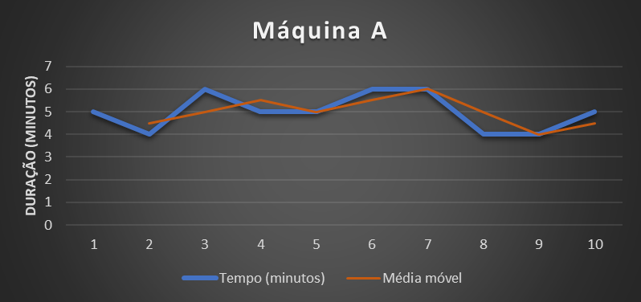
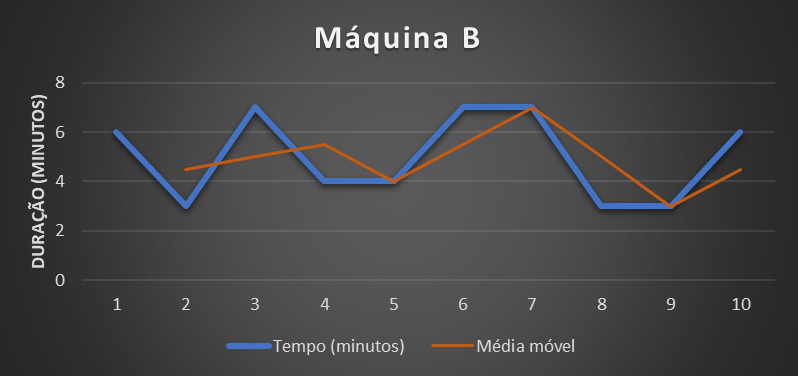

# Benchmarks

> [!IMPORTANT]
> DOCUMENTO NÃO FINALIZADO! EM CONSTRUÇÃO

## :book: Conteúdo
- [Benchmarks](#benchmarks)
  - [:book: Conteúdo](#book-conteúdo)
  - [:pushpin: O que é um benchmark?](#pushpin-o-que-é-um-benchmark)
  - [:pushpin: O que comparar?](#pushpin-o-que-comparar)
  - [:pushpin: Mitos sobre benchmarks](#pushpin-mitos-sobre-benchmarks)
    - [:pushpin: Mito 1: A única coisa que temos que avaliar é o tempo de execução do código](#pushpin-mito-1-a-única-coisa-que-temos-que-avaliar-é-o-tempo-de-execução-do-código)
    - [:pushpin: Mito 2: O código que eu escrevi é o mesmo que é executado](#pushpin-mito-2-o-código-que-eu-escrevi-é-o-mesmo-que-é-executado)

## :pushpin: O que é um benchmark?

[voltar ao topo](#book-conteúdo)

Um benchmark é uma comparação entre duas ou mais coisas. Quando não estamos comparando com algo, estamos simplesmente fazendo uma medição e não um benchmark. Mas quando estamos falando sobre software, nós associamos o termo benchmark tanto para medir a execução de algum sistema ou componente dele quanto a comparação entre sistemas e/ou componentes.

 

> [!TIP]
> Na prática, usamos o benchmark para medir e comparar o desempenho do sistema e/ou seus componentes
> 
 

## :pushpin: O que comparar?

[voltar ao topo](#book-conteúdo)

Nós podemos medir e comparar diversas coisas quando estamos falando sobre software. Podemos medir o tempo em que o sistema demora para executar determinada tarefa, podemos medir o quanto de recursos (CPU, RAM, HD, Network etc) são utilizados durante determinada ação que o software executa, podemos medir quanto tempo o sistema demora para inicializar e estar completamente pronto para realizar suas tarefas e mais um monte de coisa.

No nosso caso, estamos falando de uma biblioteca que é executada por outros sistemas. Devido a isso, nós vamos realizar medições que façam sentido para esse cenário, ou seja, nós vamos medir:

- Tempo de execução.
- Alocação de memória.
- Quantidade ciclos de processamento.
- Erros que ocorreram.
- Estabilidade do código.

 

> [!IMPORTANT]
> Nós devemos medir o que faz sentido para o cenário no qual nosso projeto foi idealizado

 

Após a medição, nós vamos realizar a comparação entre as medições de diferentes variações do código para tirarmos conclusões a partir dos dados obtidos. Mas antes, vamos analisar alguns pontos que acabam se tornando verdeiros mitos quando falamos de benchmark.

## :pushpin: Mitos sobre benchmarks

[voltar ao topo](#book-conteúdo)

Existem mitos sobre benchmarks e o objetivo é falar sobre alguns desses mitos para que possamos ter uma compreensão mais clara sobre benchmarks e ter um alinhamento claro sobre alguns pontos.

### :pushpin: Mito 1: A única coisa que temos que avaliar é o tempo de execução do código

[voltar ao topo](#book-conteúdo)

Podemos ter a impressão de que a única coisa que importa é a velocidade do código, ou seja, quanto mais rápido, melhor o código, mas isso não é uma verdade simples e absoluta.

Para entender melhor esse ponto, vamos fazer uma ilustração com duas máquinas industriais hipotéticas. Essas máquinas produzem um determinado produto. Foram produzidas uma amostra de dez produtos (claro que o ideal é produzir muito mais peças para comparar, mas para facilitar o exemplo, usaremos dez peças somente) e, para cada peça construida, anotamos o tempo que levou para cada peça. Vamos analisar os dados:

<table>

<td>

| Máquina A | Total: 50 minutos |
|:----:|:----:|
| Número peça | Duração (minutos) |
|1|5|
|2|4|
|3|6|
|4|5|
|5|5|
|6|6|
|7|6|
|8|4|
|9|4|
|10|5|

</td>

<td>

| Máquina B | Total: 50 minutos |
|:----:|:----:|
| Número peça | Duração (minutos) |
|1|6|
|2|3|
|3|7|
|4|4|
|5|4|
|6|7|
|7|7|
|8|3|
|9|3|
|10|6|

</td>

</table>

Note que tanto a `máquina A` quanto a `máquina B`  levaram um total de `50 minutos`. Já que ambas as máquinas demoraram o mesmo tempo total, quer dizer qeu ambas tiveram o mesmo desempenho? `NÃO!` Vamos analisar melhor.

 

> [!IMPORTANT]
> Códigos com eficiências diferentes podem ter o mesmo tempo de execução

  

Vamos expressar essas duas tabelas em dois gráficos:

<table>

<td>

</td>

<td>

</td>

</table>

Incluir uma série (em laranja) que representa a média móvel. Mas por quê isso? Quanto mais próximo o valor (série em azul) estiver da média móvel (série em laranja), menos variação teve, ou seja, mais estável e previsível o valor é.

Note que a `máquina A` ficou com os valores `mais próximos` da média móvel, já a `máquina B` ficou com valores `mais distantes` da média móvel. Isso quer dizer que a máquina B é mais instável. Então o que podemos concluir da análise dessas duas máquinas?

Conclusões:
- As máquinas A e B utlizaram o mesmo tempo total para produzir as 10 peças
- A máquina A foi mais estável e previsível na duração por peça do que a máquina B
- O pico de tempo mais alto da máquina A foi de 6 minutos enquanto na máquina B foi de 7 minutos

Para uma linha de produção de pe~cas, nós buscamos `previsibilidade` por isso, embora as duas máquinas demoraram o mesmo tempo total para produzir as 10 peças, a `máquina A` trouxe uma previsibilidade de tempo muito maior pois a duração da produção das peças ficou mais próxima da média móvel.

Nós medimos essa distância do valor da média móvel a partir de uma medida estatística chamada `desvio padrão`. Os devios padrões das máquinas A e B foram:

| Máquina | Desvio Padrãp |
| :-: | :-: |
| Máquina A | 0,77 |
| Máquina B | 1,67 |

 

> [!IMPORTANT]
> O desvio padrão é o controle de qualidade da média: quanto mais baixo, menos a média varia, ou seja, é mais estável!

  

Como isso se aplica com benchmarks em programação? Note o resultado de um benchmark que fizemos no documento [decisões de design](DESIGN-DECISIONS-PT.md) quando estávamos analisando sobre Exceptions:

| Type             | Method                                        | Mean (ns) | Error (ns) | StdDev (ns) | CacheMisses/Op | TotalIssues/Op | TotalCycles/Op | BranchInstructions/Op | BranchMispredictions/Op | Gen0 | Allocated (B) |
|------------------|-----------------------------------------------|-----------|------------|-------------|----------------|----------------|----------------|-----------------------|-------------------------|------|---------------|
| With null        | CreateOutputEnvelopWithoutMessageAndException | 8,603     | 0,0223     | 0,0186      | 0              | 47             | 16             | 11                    | 0                       | 0    | 0             |
| With empty array | CreateOutputEnvelopWithoutMessageAndException | 117,26    | 1,964      | 2,879       | 0              | 518            | 257            | 123                   | 0                       | 0    | 0             |

Note que a coluna `StdDev (ns)` tem o menor valor do `desvio padrão` para o teste `With null` em relação ao teste `With empty array`. Isso quer dizer que o teste `With null` foi muito mais estável com relação ao tempo de execução. Na coluna `Mean (ns)` conseguimos comprovar que o teste `With null` foi mais rápido, mas caso utilizassem o mesmo tempo ou tivessem um tempo mais próximo, deveríamos utilizar o valor do desvio padrão na análise também!

Se estivéssemos falando de memória RAM por exemplo, poderíamos ter um código que demorasse o mesmo tempo, porém, por causa do desvio padrão alto, podem ter picos de memória RAM que exijam um servidor com um a quantidade maior de memória RAM, por exemplo: O código executa com 500 MB de memória RAM, mas como o uso de memória está com um alto desvio padrão, em algum momento esse código atinge um pico de 900 MB de memória. Isso quer dizer que teríamos que ter reservado (em uma máquina, um cluster K8S etc) um total de 1 GB de memória somente para atender um possível pico de informação. Um código mais estável poderia demorar o mesmo tempo final, mas por ter um desvio padrão menor, não passar de 750 MB de RAM por exemplo.

 

> [!IMPORTANT]
> Códigos mais estáveis permitem reservar menos recurso de hardware para a aplicação

  

### :pushpin: Mito 2: O código que eu escrevi é o mesmo que é executado

[voltar ao topo](#book-conteúdo)

Nós podemos acreditar que o código que é gerado é o mesmo código que executamos, mas isso não é verdade.