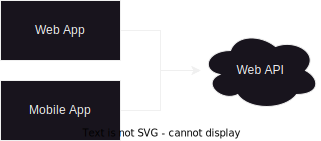
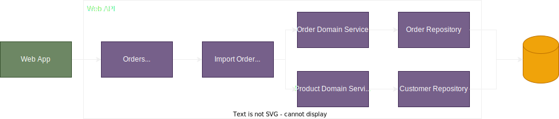
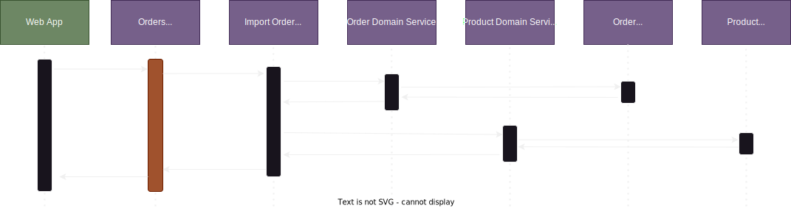

# Decisões de design

> [!IMPORTANT]
> DOCUMENTO NÃO FINALIZADO! EM CONSTRUÇÃO

## :book: Conteúdo
- [Decisões de design](#decisões-de-design)
  - [:book: Conteúdo](#book-conteúdo)
  - [:information\_source: Necessidade](#information_source-necessidade)
  - [:thinking: Analisando as possibilidades](#thinking-analisando-as-possibilidades)
    - [:pushpin: O que é uma notificação?](#pushpin-o-que-é-uma-notificação)
    - [:pushpin: Tipos de notificação](#pushpin-tipos-de-notificação)
    - [:pushpin: Lançando notificações durante a execução de métodos](#pushpin-lançando-notificações-durante-a-execução-de-métodos)
    - [:pushpin: O que devemos retornar nos métodos?](#pushpin-o-que-devemos-retornar-nos-métodos)
      - [:pushpin: Exceções: uma visão semântica sobre o assunto](#pushpin-exceções-uma-visão-semântica-sobre-o-assunto)
      - [:pushpin: Exceções: uma visão sobre desempenho](#pushpin-exceções-uma-visão-sobre-desempenho)
      - [:white\_check\_mark: Decisão de design 1: A biblioteca deve proporcionar mecanismos de controle que evite o lançamento de exceções](#white_check_mark-decisão-de-design-1-a-biblioteca-deve-proporcionar-mecanismos-de-controle-que-evite-o-lançamento-de-exceções)
      - [:pushpin: Como padronizar o retorno?](#pushpin-como-padronizar-o-retorno)
      - [:white\_check\_mark: Decisão de design 2: Precisamos criar um envelope de resposta para padronizar o retorno dos métodos](#white_check_mark-decisão-de-design-2-precisamos-criar-um-envelope-de-resposta-para-padronizar-o-retorno-dos-métodos)
    - [:pushpin: Arrays vazios ou referências nulas para array de mensagens?](#pushpin-arrays-vazios-ou-referências-nulas-para-array-de-mensagens)
    - [:white\_check\_mark: Decisão de design 3: O tratamento para evitar null reference será feito na leitura da propriedade ao invés de ser feito na criação do objeto](#white_check_mark-decisão-de-design-3-o-tratamento-para-evitar-null-reference-será-feito-na-leitura-da-propriedade-ao-invés-de-ser-feito-na-criação-do-objeto)

## :information_source: Necessidade

Durante o processamento de um método (vou tomar a liberdade de me abster de algumas formalidades como ficar se referindo a procedimentos quando não existe retorno ou função como tem retorno, chamarei tudo de método) em sistemas *LOB (Line of business)* nós, com frequência, queremos mais do que um único objeto de retorno. Isso ocorre não porque estamos projetando métodos com múltiplas responsabilidades ferindo o primeiro princípio do SOLID, mas sim, porque tem informações complementares que são importantes para esse tipo de sistema.

<br/>

> [!IMPORTANT]
> Existem vários tipos de sistemas com diferentes propósitos como sistemas para IoT, sistemas de missão crítica, sistemas para baixo nível etc. Esse pacote e toda análise foi pensado em sistemas *LOB (Line of business)*

<br/>

Esses sistemas possuem algumas características comuns. Algumas delas são:
- Autenticar o usuário que está tentando realizar a operação.
- Autorizar o usuário autenticado para a operação que está querendo realizar.
- Receber inputs dos usuários.
- Validar os inputs dos usuários.
- Validar os estados dos objetos de negócio.
- Realizar algum processo de negõcio que modifique o estado dos objetos de negócio.
- Persistir essas informações.
- Retornar o resultado da solicitação para o usuário.
- Exibir diversos relatórios a partir das informações armazenadas.

Ao atender esses cenários, algumas necessidades surgem e são comuns em todo desenvolvimento, independentemente da regra de negócio aplicada. Por exemplo:
- Queremos saber as notificações que ocorreram durante a execução dos métodos.
- Essas notificações são mais do que simples mensagens de erro, podem ser mensagens de warning (por exemplo: quando um pedido de compra ultrapassa determinado valor), podem ser mensagens informativas (por exemplo: informar a integração com os parceiros foi realizada com sucesso durante o processamento da requisição) etc.
- O processamento nem sempre se resume a sucesso ou falha. Em processamento em lote por exemplo, o resultado da operação pode ser parcial onde parte dos itens do lote são processados e outra parte não.

E a partir disso, vamos começar a construir um raciocínio que vai nos guiar e nos levará as decisões que foram tomadas para esse projeto.

## :thinking: Analisando as possibilidades

[voltar ao topo](#book-conteúdo)

Vamos começar agora a construir uma linha de raciocínio para abordar cada um desses cenários e evoluir mais em alguns outros que irão surgir de acordo com a evolução do raciocínio. O primeiro ponto que vamos conversar é sobre a necessidade dos métodos retornarem mensagens conforme coisas vão ocorrendo na sua execução.

### :pushpin: O que é uma notificação?

[voltar ao topo](#book-conteúdo)

Parece algo muito trivial e simples de responder, mas acredite em mim, a maioria ignora os detalhes. Quando analisamos o assunto temos a tendência de ignorar os detalhes e pensamos em notificação somente como uma simples mensagem composta por um texto, mas isso é superficial demais e existem mais detalhes que devemos analisar.

<br/>

> [!TIP]
> Uma notificação vai além do que ser uma simples mensagem de texto

<br/>

Existem notificações que vão além do log. É comum as aplicações terem logs que são escritos a medida que um processamento é realizado. Processos em background que ocorrem a partir de algum scheduler ou reagindo a algum evento não costumam retornar informações para a aplicação cliente que realizou o disparodo processamento, afinal de contas, tanto o disparo por meio de um scheduler ou reagindo a algum evento, são processados de forma assíncrona e não tem uma sessão de alguma aplicação cliente aguardando uma resposta, então o que faz mais sentido é realmente registar essas notificações por meio de logs, PORÉM, quando o processamento é feito a partir de uma chamada síncrona de uma aplicação cliente, é comum termos que retornar essas notificações para a aplicação cliente para que ela possa tomar alguma decisão em cima disso.

<br/>

> [!TIP]
> Quando temos uma requisição síncrona do nosso método, o chamador pode querer ler as notificações geradas para tomar alguam decisão a partir das notificações. 

> [!TIP]
> Não deixe de considerar que sua aplicação pode ter mais de uma aplicação cliente

<br/>

Imagine uma Web API que expõe um endpoint onde possibilita a abertura de pedidos de compra. Essa API é consumida por duas aplicações (uma aplicação web e outra mobile) conforme diagrama a seguir:

<br/>
<div align="center">
  
</div>
<br/>

Esse fluxo de negócio possui uma regra hipotética que, quando o pedido de compra passar de 50 mil reais, o pedido deve ser aprovado pelo gestor da área. Com base nessa regra de negócio hipotética, os sistemas, tanto web quanto mobile, devem exibir uma notificação informando que o pedido de compra foi aceito mas está pendente de aprovação do gestor da área. Essa notificação é importante pois, por mais que o sistema já possua um fluxo de aprovação, o solicitante precisa estar ciente disso de imediato para que o processo não caia no esquecimento ou até mesmo para ele possa agilizar esse processo por entrar em contato diretamente com o gestor pedindo agilidade na aprovação dependendo da criticidade da demanda.

<br/>

> [!IMPORTANT]
> Nem toda notificação é um erro

<br/>

Até o momento, nada fora do comum em sistemas *LOB (Line of business)*, porém, imagine o seguinte: Os programadores tiveram o raciocínio de que, por se tratar de uma notificação para o usuário que está utilizando o sistema, a responsabilidade de saber os critérios e quando exibir essa notificação é responsabilidade das aplicações de front-end, afinal, exibir algo é do front-end e não do back-end.

<br/>

> [!IMPORTANT]
> Nem toda notificação para o usuário é gerada no front-end

<br/>

Mas esse raciocínio não está correto. Caso isso ocorra, tanto o front-end web quanto o mobile precisariam codificar a mesma regra. Ambos teriam que saber que precisam validar o valor do pedido para notificar, ambos teriam que saber qual valor é esse e ambos teriam que saber qual é a mensagem que deveriam exibir e `esse cenário é desastroso`. Por que? Isso `causaria duplicidade na implementação` da regra de negócio pois web e mobile precisam saber e implementar a regra, além disso, poderíamos ter `inconsistências` perante essas implementações que gerariam `bugs` e `comportamentos diferentes para o mesmo recurso` entre as aplicação web e mobile. Quando o valor de referência para a notificação mudasse (o exemplo foi de 50 mil reais, imagine que mudou para 30 mil reais), teríamos que gerar uma nova versão das aplicações web e mobile (que é um problema pois os `tempo de deploy` e `disponibilização` de uma aplicação web e em uma loja de aplicativos mobile não são as mesmas) ou até criar um endpoint só para buscar esse valor `aumentando mais ainda a complexidade`.

<br/>

> [!WARNING]
> Devemos evitar duplicidade de implementação. Siga o princípio DRY (Don't repeat yourself)

> [!WARNING]
> Os deploys possuem ciclos de vida e tempo de disponibilização diferentes

<br/>

Existem até cenários pouco explorados em que esse cenário causa problemas que é quando o sistema possuí suporte a múltiplos idiomas. Se o front-end é responsável por gerar essa mensagem de notificação que é a partir de uma regra do back-end, ambas as aplicações de front-end (web e mobile) vão ter que ter a tradução correta da mensagem e, além da duplicidade e chance de maior de bugs e erros, os ciclos de deploy das aplicações são diferentes como explicado anteriormente fazendo com que a aplicação web tenha a tradução mais atualizada e a mobile não pois a loja de aplicativos demorou para atualizar ou o usuário não quis atualizar o app ainda podendo trazer até riscos legais! 
`Todos esses cenários descritos seriam desastrosos`!

<br/>

> [!TIP]
> Não deixe de considerar aspectos de globalização. Valide as chances da sua apliação precisar dar suporte a múltiplas culturas e idiomas

<br/>

Então qual seria o cenário mais adequado? Notificações que são geradas a partir de regras do back-end devem ser gerados no back-end, regras que são geradas a partir de regras exclusivas do front-end (como highligth de campos obrigatórios, tool tips etc.) devem ser geradas no front-end. Assim, se o banck-end gerar a notificação do exemplo de que pedidos acima de X reais devam ser aviasados que entraram em um fluxo de aprovação, o back-end que tem que gerar a notificação e retornar as aplicações clientes, assim não teríamos a duplicidade e a atualização da mensagem e dos crtiérios teriam efeito imediato nas aplicações web e mobile. As aplicações front-end seriam responsável somente por renderizar as notificações geradas pelo back-end e não por gerá-las.

<br/>

> [!IMPORTANT]
> Notificações que são geradas a partir de regras do back-end devem ser gerados no back-end e somente renderizadas no front-end

<br/>

Mas isso quer dizer que o back-end, ao invés de registrar as notificações somente em logs, agora o back-end precisa retornar essas notificações para a aplicação que o chamou, ou seja, chegamos a nossa primeira conclusão: `métodos precisam ter a capacidade de retornar as notificações que eles geraram`.

<br/>

> [!IMPORTANT]
> Métodos precisam ter a capacidade de retornar as notificações que eles geraram

<br/>

### :pushpin: Tipos de notificação

[voltar ao topo](#book-conteúdo)

Notificações também possuem um `tipo`. Nós temos a tendência de achar que uma notificação é somente quando algo da errado, mas nós podemos querer notificar mais que isso. Vejamos alguns exemplos:

- Uma `notificação informativa` de que os dados da declaracão do imposto de renda foram transmitidos para a receita federal.
- Uma `notificação de sucesso` de que os dados foram salvos com sucesso.
- Uma `notificação de cuidado` informando que a venda foi realizada mas que o produto está chegando perto da quantidade mínima no estoque 
- Uma `notificação de erro` informando que não foi possível processar a solicitação

<br/>

> [!IMPORTANT]
> Notificação possuem tipos: `informação`, `sucesso`, `aviso` e `erro`

<br/>

Acabou por aqui? Ainda não!

Algo que não pode ficar de fora é que em sistemas cliente/servidor, em sistemas com múltiplas aplicações clientes e em processos de atendimento de suprote, precisamos identificar rapidamente os comportamentos que o sistema apresenta, por isso, é de suma importância que cada notificação do sistema tenha um `identificador único` pois a representação daquela mensagem pode mudar dependendo da aplicação cliente e dependendo do público para o qual ela se destina.

<br/>

> [!IMPORTANT]
> A notificação precisa possuir um identificador único

<br/>

Vamos ver um `exemplo prático`:

Imagine que existe um sistema de gestão de clínica médica de um convênio XPTO que exibe uma mensagem de que a pessoa que vai em busca de atendimento, ao ser registrada no sistema, precisa de um nome. Quando essa pessoa chega na recepção, ela ainda não está em atendimento, por isso, essa pessoa não foi identificada ainda se é uma pessoa segurada pelo convênio ou não, então no sistema da recepção a mensagem seria `"a pessoa precisa possuir um nome"`. 

Agora imagine que essa pessoa foi para a triagem e lá, a pessoa enfermeira precise localizar a pessoa pelo nome dentro do sistema, porém, como essa pessoa chegou até a triagem, então ela já é uma pessoa segurada, portanto, caso o nome não foi informado, a mensagem seria `"a pessoa segurada precisa possuir um nome"`.

Agora imagine que essa pessoa, após a triagem, foi para a consulta médica e o médico atende essa pessoa e registra tudo no sistema em um computador na sua sala de atendimento. O médico localiza o a pessoa segurada pelo nome e, se o médico não informar o nome, como a pessoa segurada já está em atendimento médico, ela passa a ser um paciente e a mensagem seria `"o paciente precisa possuir um nome"`.

Esse exemplo foi bem simples e com certeza tem brechar nas regras (por exemplo: poderiam ser bounded contexts diferentes etc, mas estou assumindo um monolito sem bounded contexts), mas é um cenário que acontece com muita frequência. Note que a natureza da mensagem é a mesma e internamente é o mesmo recurso, porém, dependendo do contexto de negócio, o texto da notificação muda mas, na essência, elas são as mesmas!

Então essa mensagem poderia ser do `tipo erro`, ter o `código Person.Name.Should.Required` e ter `diferentes descrições` de acordo com o contexto e até poder possuir diferentes traduções nesses contextos. Quando a mensagem for exibida, elas poderiam ser exibidas juntamente com o código, que é padronizado, fazendo com que o sistema consiga se comunicar adequadamente para cada contexto mas permitindo que o suporte (tanto nível 1 quanto nível 2 e nível 3) encontrem a solução adequada para a solicitação da forma mais rápida possível já que se orientariam pelo código da mensagem.

<br/>

> [!TIP]
> Separar o identificador único da notificação da sua descrição vai facilitar a sua vida

<br/>

Com isso podemos concluir o que é uma notificação e quais características essa notificação precisa ter. No contexto desse projeto, essa notificação se chama OutputMessage e pode ser vista no arquivo [OutputMessage.cs](../src/OutputEnvelop/Models/OutputMessage.cs).

Uma `OutputMessage` possui a seguinte estrutura:

| Propriedade | Tipo | Valores |
| - | - | - |
| Type | OutputMessageType | `1 - Information`, `2 - Success`, `3 - Warning`, `4 - Error` |
| Code | string | - |
| Description | string | - |

### :pushpin: Lançando notificações durante a execução de métodos

[voltar ao topo](#book-conteúdo)

Lançar notificações durante a execução de um método por sí só não é um grande desafio, afinal de contas, os sistemas sempre fizeram isso por escrever essas notificações em logs, mas a questão que, inicialmente parece simpels, vai muito além disso pois agora, além do método fazer o que ele deveria fazer, ele deve retornar as notificações lançadas para o método chamador. Vamos analisar com mais detalhes.

A `primeira opção` seria a mais óbvia que é fazer o método retornar a lista de mensagens. Na linguagem C#, nós temos algumas opções para fazer isso. Vamos ver algumas quando o método não teria um retorno (ou seja, void).

Vamos ver algumas quando o método não teria um retorno (ou seja, void).

> PS: Eu sei que void é um tipo de retorno, mas para facilitar o entendimento, vou assumir a convenção padrão de que métodos que retornam void não tem retorno.

- Utilizando variáveis de saída:
```csharp
// Output retornando nullable para evitar alocação na heap mas piorando a utilização por retornar nulo
public void DoSomething(string name, out OutputMessage[]? messages)
{
    if (string.IsNullOrWhiteSpace(name))
    {
        messages = new[] { OutputMessage.Create(type: OutputMessageType.Error, code: "...", description: "...") };
        return;
    }

    Name = name;

    messages = null;
}

// Output retornando um array vazio para facilitar a utilização mas gerando alocação na heap
public void DoSomething(string name, out OutputMessage[] messages)
{
    if (string.IsNullOrWhiteSpace(name))
    {
        messages = new[] { OutputMessage.Create(type: OutputMessageType.Error, code: "...", description: "...") };
        return;
    }

    Name = name;

    messages = Array.Empty<OutputMessage>();
}
```

- Utilizando o retorno do método:
```csharp
// Retornando nullable para evitar alocação na heap mas piorando a utilização por retornar nulo
public OutputMessage[]? DoSomething(string name)
{
    if (string.IsNullOrWhiteSpace(name))
        return new[] { OutputMessage.Create(type: OutputMessageType.Error, code: "...", description: "...") };

    Name = name;

    return null;
}

// Retornando um array vazio para facilitar a utilização mas gerando alocação na heap
public OutputMessage[] DoSomething(string name)
{
    if (string.IsNullOrWhiteSpace(name))
        return new[] { OutputMessage.Create(type: OutputMessageType.Error, code: "...", description: "...") };

    Name = name;

    return Array.Empty<OutputMessage>();
}
```

<br/> 

Agora vamos analisar esses casos com `métodos que teriam um retorno`:

<br/> 

- Utilizando variáveis de saída:
```csharp
// Output retornando nullable para evitar alocação na heap mas piorando a utilização por retornar nulo
public bool DoSomething(string name, out OutputMessage[]? messages)
{
    if (string.IsNullOrWhiteSpace(name))
    {
        messages = new[] { OutputMessage.Create(type: OutputMessageType.Error, code: "...", description: "...") };
        return false;
    }

    Name = name;

    messages = null;

    return true;
}

// Output retornando um array vazio para facilitar a utilização mas gerando alocação na heap
public bool DoSomething(string name, out OutputMessage[] messages)
{
    if (string.IsNullOrWhiteSpace(name))
    {
        messages = new[] { OutputMessage.Create(type: OutputMessageType.Error, code: "...", description: "...") };
        return false;
    }

    Name = name;

    messages = Array.Empty<OutputMessage>();

    return true;
}
```

- Utilizando o retorno do método:
```csharp
// Retornando nullable para evitar alocação na heap mas piorando a utilização por retornar nulo. Por ter mais de um valor, o retorno precisa ser uma tupla
public (bool Success, OutputMessage[]? OutputMessageCollection) DoSomething(string name)
{
    if (string.IsNullOrWhiteSpace(name))
        return (Success: false,  OutputMessageCollection: new[] { new OutputMessage(type: OutputMessageType.Error, code: "...", description: "...") });

    Name = name;

    return (Success: true, OutputMessageCollection: null);
}

// Retornando um array vazio para facilitar a utilização mas gerando alocação na heap. Por ter mais de um valor, o retorno precisa ser uma tupla
public (bool Success, OutputMessage[] OutputMessageCollection) DoSomething(string name)
{
    if (string.IsNullOrWhiteSpace(name))
        return (Success: false,  OutputMessageCollection: new[] { new OutputMessage(type: OutputMessageType.Error, code: "...", description: "...") });

    Name = name;

    return (Success: true, OutputMessageCollection: Array.Empty<OutputMessage>());
}
```

### :pushpin: O que devemos retornar nos métodos?

[voltar ao topo](#book-conteúdo)

Nos exemplos acima, nós retornamos uma coleção de OutputMessage quando o método não possuia um retorno esperado (void) e retornamos uma tupla quando, além da coleção de OutputMessage, temos algum valor esperado para retornar. Mas quero aprofundar mais nesse assunto e analisar alguns pontos que considero importantes.

Quando chamamos um método, nós esperamos saber algumas coisas sobre ele após a sua execução, essas coisas são:

- Ocorreu algum erro inesperado durante a execução?
- Se ocorreu um erro inesperado, qual erro que ocorreu?
- O método executou com sucesso fazendo tudo o que deveria fazer?
- Consigo saber se o processo foi executado de forma parcial (importação de itens de um lote onde parte foi improtado e parte não por exemplo)?
- Consigo saber todas as notificações que ocorreram durante a execução desse método?
- Consigo identificar de forma clara o retorno desse método?
- Consigo interpretar e ler de forma clara a intenção do retorno desse método?

São perguntas que geralmente não fazemos mas são improtantes. Vamos falar de cada uma delas.

A primeira pergunta é: `Ocorreu algum erro inesperado durante a execução?`. Essa pergunta é importante pois o raciocínio natural de qualquer programador iniciante é pensar que `se o método não lançou nenhuma exceção, é porque não ocorreu nenhum erro inesperado`. Esse é um pensamento natural, mas temos que tomar muito cuidado com o uso incorreto ou desnecessário de exceções para controlar o fluxo de execução.

É muito confortável para nós, programadores, utilizar exceções para controlar o fluxo da aplicação, afinal de contas, é só colocar um `try/catch` e está tudo certo, o controle de fluxo está feito, fica muito fácil saber se ocorreu um erro e tratar esse fluxo. Mas temos que considerar alguns pontos importantes com relação ao uso de exceções.

> [!WARNING]
> Exceções são amigáveis para o programador pois facilitam o controle do fluxo de execução do código, porém, tem pontos importantes que temos que analisar ao lançar exceções

#### :pushpin: Exceções: uma visão semântica sobre o assunto

[voltar ao topo](#book-conteúdo)

Em programação, quando falamos da semântica, estamos nos referindo ao sentido, ao significado de determinada coisa. Com relação a exceção, analisar o significado do que é uma exceção pode nos trazer algumas ideias interessantes.

Como o próprio nome diz, uma exceção é algo que ocorre a critério de exceção, ou seja, é algo que ocorre além da regra estabelecida. Vamos utilizar algo do nosso cotidiano para entender melhor: nós possuímos regras de trânsito e, uma delas, é que não podemos passar por um semáforo que esteja na cor vermelha e isso é uma regra, porém, se você estiver em situação de emergência médica, podemos recorrer aquela infração de ultrapassar um semáforo vermelho pois a situação foge a regra padrão pois se tratava de uma emergência médica que envolvia vida e morte e a regra foi pensada na situação geral, por isso, essa situação seria uma exceção a regra.

Quando estamos nos referindo ao nosso programa, quando falamos de exceção, estamos falando de algo que ocorre de forma inesperada, que o processamento `não preveu`, ou seja, é algo `INESPERADO`.

É importante prestar bem atenção nisso que acabamos de ver pois, se o nosso método prevê algum cenário e faz a tratativa desse cenário, aquele cenário não é uma exceção, mas sim, algo esperado que se ocorra pois o próprio método conhece o problema e está tratando o problema, ou seja, ao invés de ser uma exceção, faz parte do processamento do método pois é algo conhecido e tratável.

> [!TIP]
> Semanticamente, uma exceção é algo que foge a regra. Em programação, uma exceção é algo que ocorreu de forma inesperada. Se existe uma tratativa consciente no método para determinado cenário, esse cenário não é uma exceção e passa a fazer parte da regra pois é tratável.

Vamos ver um exemplo. Veja o código a seguir:

```csharp
public class Customer
{
    public string Name { get; private set; }

    public void ChangeName(string name)
    {
        if(string.IsNullOrEmpty(name))
            throw new ArgumentNullException(name);
        else if(name.Length == 0 || name.Length > 50)
            throw new ArgumentOutOfRangeException(name);

        Name = name;
    }
}
public class CustomerService
{
    public void ChangeCustomerName(Guid customerId, string newName)
    {
        var customer = _customerRepository.GetById(customerId);

        // Eu não preciso tratar se o ChangeName deu certo, pois, caso um erro
        // ocorra, a chamada do método _customerRepository.Update
        // não ocorrerá pois o fluxo de execução será interrompido pela exceção
        // e não precisaremos nos preocupar com a tratativa do fluxo do código
        customer.ChangeName(newName);

        _customerRepository.Update(customer);
    }
}
```

No código acima temos o a classe `Customer` com método `void ChangeName(string name)` que valida o parâmetro `name` e, caso esteja nulo ou com um tamanho inválido, uma exceção é lançada para cada cenário inválido. Note que esses cenários do parâmetro `name` ser nulo ou ter um tamanho inválido são conhecidos e tratados no código, então, semanticamente, não é uma exceção, mas sim, parte da regra.

Noter que na classe `CustomerService` não precisamos fazer nenhuma tratativa caso o método `ChangeName` tenha algum erro, pois ele lançará uma exceção e tudo se resolverá magicamente. Isso é muito confortável para nós, programadores.

Vamos analisar esse código se utilizássemos a semântica correta e evitássemos o uso de exceção nesse cenário:

```csharp
public class Customer
{
    public string Name { get; private set; }

    public void ChangeName(string name, out bool success)
    {
        if(string.IsNullOrEmpty(name) || (name.Length == 0 || name.Length > 50))
        {
            success = false;
            return;
        }

        Name = name;

        success = true;
    }
}
public class CustomerService
{
    public void ChangeCustomerName(Guid customerId, string newName)
    {
        var customer = _customerRepository.GetById(customerId);

        // Agora tivemos que analisar o retorno do método ChangeName
        // pois o controle de fluxo não será feito automaticamente
        // pelo lançamento da exceção. Caso não tratarmos a variável
        // de saída success, podemos mandar atualizar no banco de dados
        // mesmo se a execução não foi realizada com sucesso
        customer.ChangeName(newName, out bool success);
        if(!success)
            return;

        _customerRepository.Update(customer);
    }
}
```

Como visto no código acima, tratar as coisas com a semântica correta e não lançar a exceção para as regras conhecidas acaba gerando mais complicação para a manutenabilidade da aplicação do que solução pois, se o programador esquecer de tratar o retorno do método, podemos ter comportamentos indesejados. Isso faz com que a `programação defensiva` seja ainda mais importante nesse cenário.

> [!CAUTION]
> Deixar de lançar exceções, mesmo que seja para utilizar a semântica correta, acarreta na necessidade de termos um código mais sucetível a erros por falha humana. Nesses cenários temos que tomar cuidado pois o código vai exigir mais do code review, testes e práticas de programação defensiva.

Ao analisar esses pontos, podemos chegar a conclusão de que devemos então lançar exceções mesmo que, em cenários onde a regra é tratável, não seja semanticamente correto pois as facilidades compensam. Porém, infelizmente, as coisas não são tão simples assim (embora eu gostaria muito que fosse, também gosto de usar as exceções pela facilidade que elas trazem).

#### :pushpin: Exceções: uma visão sobre desempenho

Lançar exceções no nosso código trás uma consequência que, em determinados cenários, pode ser desastrosa. Estou falando da `degradação do desempenho da aplicação`.

Quando lançamos uma exceção no .NET, várias coisas ocorrem. Algumas delas são:

- O tipo da exceção é capturada
- Uma mensagem com todos os detalhes da exceção é criada
- Todo stack trace é capturado
- Dados adicionais da exceção são preenchidos
- O objeto de origem da exceção é capturado
- O método que originou a exceção é capturado
- A InnerException é captura para identificar se uma exceção foi lançada a partir da outra

Para que tudo isso ocorra, a `thread que está lançando a exceção é bloqueada`, `processamento é realizado para colher as informações` e `objetos adicionais são criados` gerando `mais alocação de objetos no Garbage Collector`.

> [!CAUTION]
> Quando estamos falando em aplicações de alta volumetria, lançar exceções pode traze danos ao desempenho e fazer com que a aplicação exija bem mais recursos do que realmente são necessários

#### :white_check_mark: Decisão de design 1: A biblioteca deve proporcionar mecanismos de controle que evite o lançamento de exceções

[voltar ao topo](#book-conteúdo)

Vamos ver o resultado de um benchmark para vermos isso na prática (o benchmark executado está no arquivo [ThrowExceptionBenchmark](../benchs/Benchmarks/ExceptionBenchs/ThrowExceptionBenchmark.cs)). O resultado obtido foi:

| Method        | Mean           | Error       | StdDev      | Ratio     | RatioSD  | BranchInstructions/Op | TotalIssues/Op | TotalCycles/Op | Timer/Op | BranchMispredictions/Op | CacheMisses/Op | Allocated | Alloc Ratio |
|-------------- |---------------:|------------:|------------:|----------:|---------:|----------------------:|---------------:|---------------:|---------:|------------------------:|---------------:|----------:|------------:|
| NoException   |      0.5812 ns |   0.0680 ns |   0.0907 ns |      1.00 |     0.00 |                     0 |              3 |              1 |        0 |                       0 |             -0 |         - |          NA |
| WithException | 23,385.8588 ns | 306.3089 ns | 271.5349 ns | 41,163.98 | 7,019.46 |                17,480 |         78,557 |         54,265 |      236 |                     136 |            385 |     232 B |          NA |

Vamos as conclusões:

- Como podemos analisar na coluna `Ratio`, o método que lançou a exceção foi `41 MIL vezes mais lento`.
- Na coluna `RatioSD` vemos que o método que lançou a exceção teve um desvio padrão `7 MIL vezes maior`, ou seja, muito mais instável.
- Ao analisar as instruções e ciclos por operação, a versão com lançamento de exception fez `milhares de vezes mais operações`.
- O código que lança exceção `gerou alocação` enquanto o que não lança exceção não gerou alocação na heap.

Como o objetivo dessa biblioteca é dar suporte a processamentos de auto desempenho, nós chegamos a nossa primeira decisão de design!

> [!IMPORTANT]
> Nós temos que avaliar os requisitos dos nossos projetos para determinar se o uso de exceções causará um impacto real ou não na aplicação. 

#### :pushpin: Como padronizar o retorno?

[voltar ao topo](#book-conteúdo)

Como vimos anteriormente, vamos evitar o uso de exceções e, quando o nosso método possuí um retorno esperado além da coleção de OutputMessage, podemos ter um código que acabe retornando tuplas ou tenham variáveis de output.

Embora a linguagem permita o uso desses recursos, nós temos sempre que tentar deixar o nosso código o mais coeso e o mais simples de entender que conseguirmos.

> [!TIP]
> Nosso código precisar ser simples e coeso. Se precisa ser um sênior para fazer qualquer coisa no seu sistema, temos um problema

Então vamos analisar o uso de tuplas como retorno ou de parâmetros de saída e os impactos disso no nosso código. Vamos começar pelo retorno usando tuplas. Note o código a seguir:

```csharp
public enum ResultType
{
    Success = 1,
    Partial = 2,
    Error = 3
}

public (OutputMessage[]? OutputMessageCollection, ResultType ResultType, Customer? RegisteredCustomer) RegisterNewCustomer(string email)
{
    if(string.IsNullOrWhiteSpace(email))
        return (
            OutputMessageCollection: new [] {
                OutputMessage.CreateError(code: "Customer.Email.Should.Required")
            },
            ResultType: ResultType.Error, 
            RegisteredCustomer: null
        );
    
    // Seu código de processamento

    return (OutputMessageCollection: null, ResultType: ResultType.Success, RegisteredCustomer: customer);
}

public (OutputMessage[]? OutputMessageCollection, ResultType ResultType, Customer? RemovedCustomer) RemoveCustomer(string email)
{
    if(string.IsNullOrWhiteSpace(email))
        return (
            OutputMessageCollection: new [] {
                OutputMessage.CreateError(code: "Customer.Email.Should.Required")
            },
            ResultType: ResultType.Error, 
            RemovedCustomer: null
        );
    
    // Seu código de processamento

    return (OutputMessageCollection: null, ResultType: ResultType.Success, RemovedCustomer: customer);
}
```

O que podemos concluir desse código:

- Utilizar tupla é algo simples (utilizar uma tupla é algo simples na linguagem C#) porém não é trivial (embora simples, programadores iniciantes tem dificuldade de lidar com a sintaxe e pelo fato da tupla ser um value type).
- Dependendo da quantidade de informações adicionais que você queira saber sobre a execução dos métodos, a tupla terá vários parâmetros sendo difícil de ler o código.
- Caso quisermos incluir uma nova informação no retorno dos métodos, temos que alterar todas as tuplas de todos os métodos e alterar todas as atribuições do retorno desses métodos para se adequarem a nova estrutura da tupla. Seria uma loucura!

> [!CAUTION]
> Embora as tuplas sejam um recurso da linguagem, dependendo de como ela for utilizada, pode gerar diversos problemas de design de código causando dificuldade de leitura, compreensão e manitunabilidade

`Por esses motivos não utilizaremos tuplas no retorno!`

Agora vamos analisar a utilização de parâmetros de saída (output) nos métodos. Vamos analisar o mesmo código, porém, com variáveis de saída:

```csharp
public enum ResultType
{
    Success = 1,
    Partial = 2,
    Error = 3
}

public Customer? RegisterNewCustomer(string email, out OutputMessage[]? OutputMessageCollection, out ResultType ResultType)
{
    if(string.IsNullOrWhiteSpace(email))
    {
        OutputMessageCollection = new [] {
            OutputMessage.CreateError(code: "Customer.Email.Should.Required")
        };

        ResultType = ResultType.Error;

        return null;
    }
    
    // Seu código de processamento

    OutputMessageCollection = null;
    ResultType = ResultType.Success;

    return customer;
}

public Customer? RemoveCustomer(string email, out OutputMessage[]? OutputMessageCollection, out ResultType ResultType)
{
    if(string.IsNullOrWhiteSpace(email))
    {
        OutputMessageCollection = new [] {
            OutputMessage.CreateError(code: "Customer.Email.Should.Required")
        };

        ResultType = ResultType.Error;

        return null;
    }
    
    // Seu código de processamento

    OutputMessageCollection = null;
    ResultType = ResultType.Success;

    return customer;
}

// Exemplo do consumo
public bool Register(string email)
{
    RegisterNewCustomer(email, out OutputMessage[]? outputMessageCollection, out ResultType resultType);

    if(resultType != ResultType.Success)
        return false;

    // ...

    return true;
}
```

O que podemos concluir desse código:

- Todos os problemas apontados na utilização das tuplas
- Obrigamos o código que consome a declarar as variáveis de saída ou usar o operador de descarte fazendo com que uma alteração na assinatura resultasse também na alteração de todos os chamadores desses métodos.

#### :white_check_mark: Decisão de design 2: Precisamos criar um envelope de resposta para padronizar o retorno dos métodos

[voltar ao topo](#book-conteúdo)

Para evitar quebras de código durante a remoção ou inclusão de novas propriedades que queremos analisar sobre a execução do método e poder padronizar toda a comunicação entre os métodos, é importante que criemos um evenlope de reposta. O que seria isso?

Imagine uma carta em um envelope. Nós temos a carta, que é o nosso objeto de interesse, mas temos um envelope que tem informações adicionais sobre a carta como o emissor, destinatário, selo postal etc. Note que o objeto de interesse é a carta, mas temos informações adicionais que vão além da carta que também são importantes. Então ao invés de adicionarmos essas informações na própria carta de forma padronizada dificultando o trabalho da agência de correios, é melhor criarmos um envelope padronizado para facilitar a análise e deixar a carta, que é o conteúdo sem padrão e que não pode ser modificado, dentro desse envelope, ou seja, encapsulamos a carta com um envelope.

O raciocínio aqui é o mesmo, vamos pegar todas aquelas informações extras que queremos da execução de um método em um envelope que vai encapsular a resposta do método. Assim conseguimos padronizar os retornos dentro do sistema e não ter os problemas que mencionamos anteriormente!

> [!TIP]
> Criar encapsulamentos nos permitem padronizar os objetos melhorando a manitenabilidade e compreensão da aplicação!

### :pushpin: Arrays vazios ou referências nulas para array de mensagens?

[voltar ao topo](#book-conteúdo)

Vamos analisar essas duas opções primeiro que acabamos de ver. Vamos começar pelo retorno de um array vazio ou um retorno nulo quando não houverem mensagens. Nós vamos analisar pelo viés da usabilidade e do desempenho.

Ao olhar pelo viés da usabilidade, é mais interessante ter um array vazio do que um valor nulo pois evita possíveis exceções de referências nulas. Utilizar um array vazio vindo de uma constante do .NET como um Array.Empty também não causará pressão no Garbage Collector pois não haverá instanciações de novos arrays. Para reproduzir e validar esse cenário que acabei de afirmar, vamos executar dois benchamrks (detalhes sobre os benchmarks podem ser encontrados na [documentação sobre benchmark](BENCHMARKS-PT.md)).

A seguir temos parte do código do objeto [OutputEnvelop.cs](../src/OutputEnvelop/OutputEnvelop.cs). No construtor do objeto recebemos alguns parâmetros e definimos algumas propriedades que são readonly.

Como a biblioteca é feita para o .NET Standard 2.0, não existe suporte a deixar explícito o nullable para arrays, porém, é possível mesmo assim passar `null` no array. Sendo assim, as parâmetros `OutputMessage[] outputMessageCollection` e `Exception[] exceptionCollection` do construtor podem vir nulos.

Note que esses parâmetros do construtor mencionados anteriormente alimentam duas propriedades com o modificador de acesso `internal`. Nós falaremos disso posteriormente.

O ponto de agora é que o código atual permite que as propriedades `internal` tenham valores nulos, conforme demontrado a seguir:

```csharp
// Versão que aceita nulo
public readonly struct OutputEnvelop<TOutput>
{
    // Properties
    internal OutputMessage[] OutputMessageCollectionInternal { get; }
    internal Exception[] ExceptionCollectionInternal { get; }

    public TOutput Output { get; }
    public OutputEnvelopType Type { get; }

    // Constructors
    private OutputEnvelop(
        TOutput output,
        OutputEnvelopType type,
        OutputMessage[] outputMessageCollection,
        Exception[] exceptionCollection
    )
    {
        Output = output;
        Type = type;
        OutputMessageCollectionInternal = outputMessageCollection;
        ExceptionCollectionInternal = exceptionCollection;
    }
}
```

Uma alternativa para que esse objeto passe um Array vazio ao invés de permitir nulo seria checar se o parâmetro do construtor é nulo e substituir por uma constante de um Array vazio conforme a seguir:

```csharp
// Versão que não aceita nulo
public readonly struct OutputEnvelop<TOutput>
{
    // Properties
    internal OutputMessage[] OutputMessageCollectionInternal { get; }
    internal Exception[] ExceptionCollectionInternal { get; }

    public TOutput Output { get; }
    public OutputEnvelopType Type { get; }

    // Constructors
    private OutputEnvelop(
        TOutput output,
        OutputEnvelopType type,
        OutputMessage[] outputMessageCollection,
        Exception[] exceptionCollection
    )
    {
        Output = output;
        Type = type;
        OutputMessageCollectionInternal = outputMessageCollection ?? Array.Empty<OutputMessage>();
        ExceptionCollectionInternal = exceptionCollection ?? Array.Empty<Exception>();
    }
}
```

Para medir o impacto dessas duas versões, vamos executar o benchmark do arquivo [CreateOutputEnvelopBenchmark.cs](../benchs/Benchmarks/OutputEnvelopBenchs/CreateOutputEnvelopBenchmark.cs) e analisar o teste `CreateOutputEnvelopWithoutMessageAndException` que vai passar uma coleção de mensagens e exceptions nulas para o cenário que queremos testar. Para cada uma das variações acima vamos executar o mesmo teste e vamos analisar o retorno. Primeiro, vamos aos resultados brutos dos benchmarks:

| Type             | Method                                        | Mean (ns) | Error (ns) | StdDev (ns) | CacheMisses/Op | TotalIssues/Op | TotalCycles/Op | BranchInstructions/Op | BranchMispredictions/Op | Gen0 | Allocated (B) |
|------------------|-----------------------------------------------|-----------|------------|-------------|----------------|----------------|----------------|-----------------------|-------------------------|------|---------------|
| With null        | CreateOutputEnvelopWithoutMessageAndException | 8,603     | 0,0223     | 0,0186      | 0              | 47             | 16             | 11                    | 0                       | 0    | 0             |
| With empty array | CreateOutputEnvelopWithoutMessageAndException | 117,26    | 1,964      | 2,879       | 0              | 518            | 257            | 123                   | 0                       | 0    | 0             |

A primeira coluna (`Type`) refere-se aos nossos dois cenários passando o valor nulo ou o array vazio. Agora vamos analisar esses dados com mais detalhes.

Na coluna `Mean (ns)` temos o tempo médio de execução e já conseguimos notar algo já bem impactante. A versão com o `valor nulo` fez em `8,6 nanosegundos`, já a `versão com o Array.Empty` foi de `117,26`. Isso quer dizer que o código passando o `Array.Empty foi cerca de 13,6 vezes pior`.

Na coluna `Erros (ns)` temos o tempo total gasto com erros durante a execução e, ao comparar os dados, conseguimos ver que o código com o `Array.Empty foi 88 vezes pior`.

Na coluna `StdDev (ns)` conseguirmos ver o desvio padrão das execuções. Quanto menor o desvio padrão, mais estável o código é e menores serão os picos para baixo ou para cima. No arquivo sobre [benchmarks](BENCHMARKS-PT.md) tem mais detalhes sobre o que é o desvio padrão. A versão com `Array.Empty foi bem mais instável`.

Quando analisamos `TotalIssues/Op`, `TotalCycles/Op` e `BranchInstructions/Op` também vemos a clara diferença onde com `Array.Empty` apresentou muito `mais erros e quantidade de instruções`.

Agora, quando analisamos a alocação de memória, ambos os cenários não geraram alocação.

O que podemos concluir disso?
- :white_check_mark: Conclusão 1 - A versão com o valor nulo é mais rápida.
- :white_check_mark: Conclusão 2 - A versão com o valor nulo é mais estável.
- :white_check_mark: Conclusão 3 - A versão com o valor nulo tem uma usabilidade pior pois joga a responsabilidade de tratar o valor nulo para o método chamador.

Então temos duas conclusões a favor de usar a opção com o valor nulo (todos relacionados ao desempenho) e uma conclusão a favor de utilizar o Array.Empty (que é relacionado a usabilidade do código). Então qual das duas abordagens escolher? Na verdade, nós não precisamos escolher uma ou outra, tem uma alternativa que podemos utilizar onde podemos nos beneficiar das duas abordagens.

Para entender o ponto, vamos analisar o diagrama abaixo que representa uma Web API com seus componentes internos (o objetivo desse diagrama não é apresentar um modelo de componentes de referência e nem dizer se a divisão é boa ou ruim, ela serve somente para o nosso exemplo).

<br/>
<div align="center">
  
</div>
<br/>

Nesse diagrama temos a representação de um Web App que solicita para uma Web API a importação de um pedido. Durante essa importação, tanto o pedido quanto os produtos do pedido são importados. Para ajudar a compreender esse fluxo, repare no diagrama de sequência a seguir:

<br/>
<div align="center">
  
</div>
<br/>

Cada execução de cada método de cada componente retornaria um envelope de resposta, então nesse fluxo acima, teríamos os seguintes envelopes de resposta:

- Evelope de resposta da execução do método do componente CustomerRepository.
- Evelope de resposta da execução do método do componente OrderRepository.
- Evelope de resposta da execução do método do componente ProductDomainService.
- Evelope de resposta da execução do método do componente OrderDomainService.
- Evelope de resposta da execução do método do componente ImportOrderUseCase.
- Evelope de resposta da execução do método do componente OrdersController.

De todos os seis envelopes de repostas que seriam criados, somente em um momento a leitura das notificações seria feita que seria na OrdersControllers (marcado de laranja) pois seria o momento que iria-se compor o retorno da chamada síncrona realizada pelo WebApp. Isso quer dizer que, no exemplo acima, `enquanto seis criações de envelopes de resposta são feitas, somente uma leitura das notificações é realizada`, ou seja, nesse cenário de aplicações *LOB (Line of Business)*, iremos realizar muito mais criações de envelopes de respostas do que a leitura das notificações.

<br/>

> [!TIP]
> Devemos compreender o perfil de utilização de cada objeto

<br/>

### :white_check_mark: Decisão de design 3: O tratamento para evitar null reference será feito na leitura da propriedade ao invés de ser feito na criação do objeto

[voltar ao topo](#book-conteúdo)

E onde isso ajuda em decidir se vamos usar referência nula ou array vazio?

Como vimos que criamos muito mais notificações do que lemos, nós podemos fazer algo simples, mas que vai resolver nosso problema e permitir usar o melhor dos dois cenários. `Nós podemos remover o código que resolveria um problema de leitura do momento da criação`!

Note novamente o código que usamos para tratar o Array.Empty com os devidos comentários no código:

```csharp
// Versão que não aceita nulo
public readonly struct OutputEnvelop<TOutput>
{
    // Properties
    internal OutputMessage[] OutputMessageCollectionInternal { get; }
    internal Exception[] ExceptionCollectionInternal { get; }

    public TOutput Output { get; }
    public OutputEnvelopType Type { get; }

    // Constructors
    private OutputEnvelop(
        TOutput output,
        OutputEnvelopType type,
        OutputMessage[] outputMessageCollection,
        Exception[] exceptionCollection
    )
    {
        Output = output;
        Type = type;
        // Estamos resolvendo um problema da leitura no momento da instanciação
        // sendo que na maioria das vezes nós não vamos realizar essa leitura.
        // Com isso, estamos usando um processamento 100% das vezes para algo 
        // que não será usado o tempo todo
        OutputMessageCollectionInternal = outputMessageCollection ?? Array.Empty<OutputMessage>();
        ExceptionCollectionInternal = exceptionCollection ?? Array.Empty<Exception>();
    }
}
```

Agora vamos remover essa tratativa de nulo do construtor e encapsular em uma propriedade. Note que como a classe tem os arrays como propriedades `internal`, nós precisamos export essess valores publicamente para outras classes acessarem. A implementação da solução ficaria assim:

```csharp
public readonly struct OutputEnvelop<TOutput>
{
    // Properties
    internal OutputMessage[] OutputMessageCollectionInternal { get; }
    internal Exception[] ExceptionCollectionInternal { get; }

    // Incluimos uma propriedade para leitura que encapsula o array internal
    public IEnumerable<OutputMessage> OutputMessageCollection
    {
        get
        {
            // Tratamos o valor nulo no momento da leitura e evitamos a referência nula
            // somente no momento em que a leitura for solicitada
            if (OutputMessageCollectionInternal is null)
                yield break;

            for (int i = 0; i < OutputMessageCollectionInternal.Length; i++)
                yield return OutputMessageCollectionInternal[i];
        }
    }
    // Incluimos uma propriedade para leitura que encapsula o array internal
    public IEnumerable<Exception> ExceptionCollection
    {
        get
        {
            // Tratamos o valor nulo no momento da leitura e evitamos a referência nula
            // somente no momento em que a leitura for solicitada
            if (ExceptionCollectionInternal is null)
                yield break;

            for (int i = 0; i < ExceptionCollectionInternal.Length; i++)
                yield return ExceptionCollectionInternal[i];
        }
    }

    public TOutput Output { get; }
    public OutputEnvelopType Type { get; }

    // Constructors
    private OutputEnvelop(
        TOutput output,
        OutputEnvelopType type,
        OutputMessage[] outputMessageCollection,
        Exception[] exceptionCollection
    )
    {
        Output = output;
        Type = type;
        // Nós permitimos a atribuição do valor nulo pois
        // vamos tratar isso somente na leitura
        OutputMessageCollectionInternal = outputMessageCollection;
        ExceptionCollectionInternal = exceptionCollection;
    }
}
```

Com isso conseguimos obter o desempenho da criação com valores nulos mas manter a usabilidade de permitir uma leitura que evitará instâncias nulas! Vamos ver com mais detalhes a solução aplicada.

